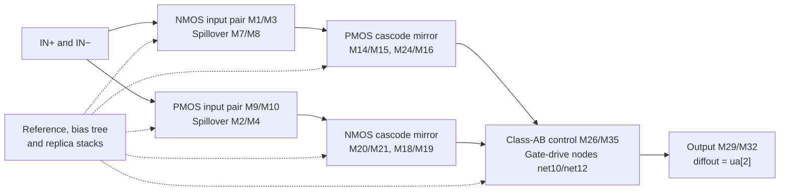
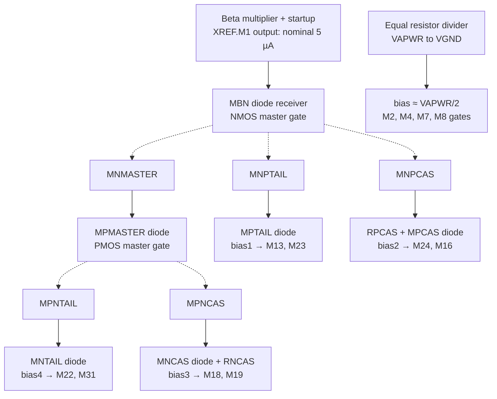
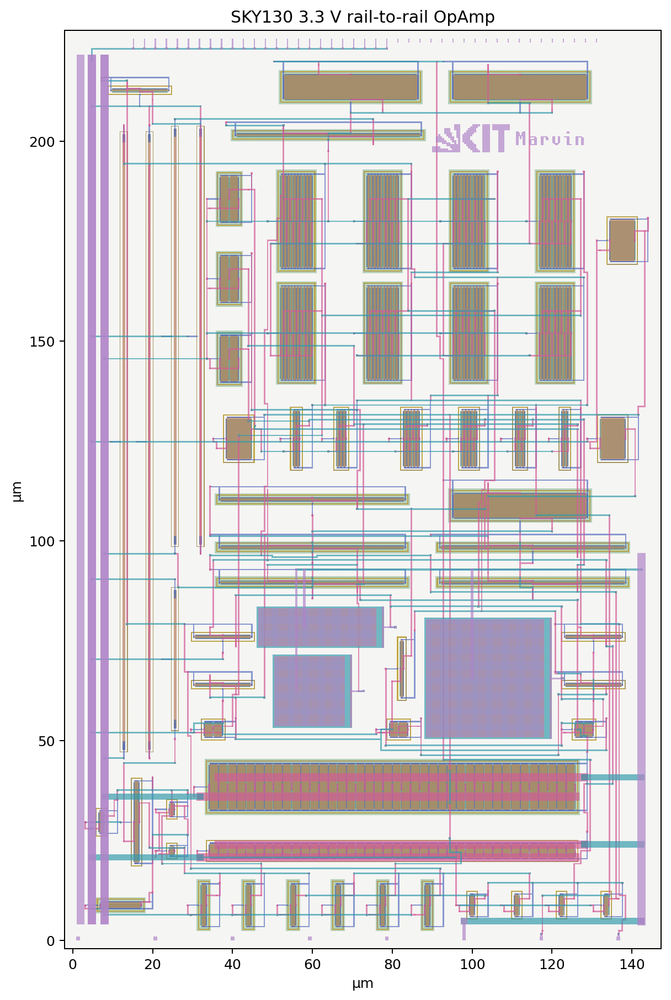
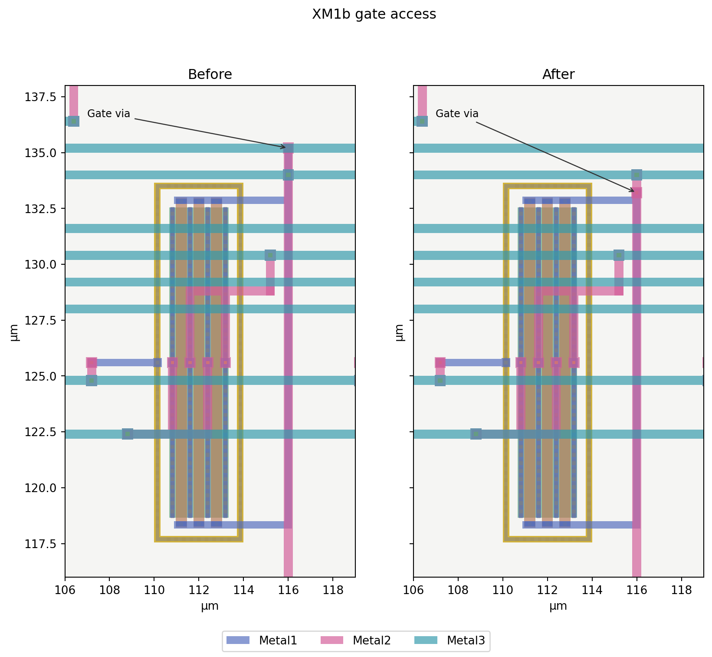

# Circuit and layout

## Architecture and design reference

The amplifier follows the compact rail-to-rail input/output, class-AB architecture described in Johan H. Huijsing, *Operational Amplifiers*, Fig. 7.7.6, with GA-CF-GA configuration and Miller compensation. The implemented schematic is a SKY130 adaptation: its device labels, dimensions, bias network and compensation values must be read from the current source rather than copied from the book's 2 V example.

The [main schematic](../xschem/opamp-rrio-cgm-3v3.sch) has complementary input stages, cascode current mirrors, replica-biased class-AB control and a complementary output pair. The bias hierarchy is [opamp_bias_3v3](../xschem/opamp_bias_3v3.sch), containing [reference_bias_3v3](../xschem/reference_bias_3v3.sch). The amplifier uses VAPWR and VGND; the wrapper exposes the separate VDPWR supply required by the shuttle.



This is a functional block diagram. The transistor-level source defines the electrical connections, including the internal floating-current copy and compensation paths described below.

## Complementary input stage

M1/M3 form the NMOS signal-input pair and share tail sink M22. M9/M10 form the PMOS pair and share tail source M13. PMOS input devices support operation near ground; NMOS devices support operation near the positive rail. Both groups contribute through the crossover region.

Each tail also feeds two equal-size spillover devices connected into the same drain branches. M7/M8 belong to the NMOS side and M2/M4 to the PMOS side. Their gates receive the midpoint voltage `bias`. They redistribute current with common-mode voltage to reduce the change in total input transconductance as the complementary input pairs hand over. Constant transconductance is the design intent; neither perfect gm equality nor zero crossover distortion follows from connectivity alone.

The input common-mode range and output swing are distinct. A follower sweep changes both at once. The separate earlier common-mode study held the output near mid-supply using a test-only level shift; see [Verification](verification.md) for its scope.

## Current summation, class-AB control and output

The NMOS input branch currents feed the PMOS cascode mirror M14/M15 with M24/M16. The PMOS input branch currents feed the NMOS cascode mirror M20/M21 with M18/M19. Output-side mirror nodes `net10` and `net12` drive the gates of output PMOS M29 and output NMOS M32.

M29 pulls the output toward VAPWR; M32 pulls it toward VGND. Their sources and bulks are rail-connected. M26 and M35 form a complementary, parallel class-AB control pair between the two gate-drive nodes. Its operating point establishes the gate separation needed for quiescent conduction while allowing signal-dependent sourcing and sinking.

Two replica stacks generate its control voltages:

- M23 feeds diode-connected NMOS M25/M30, producing `net8`. To first order, `net8 = VGS(M30) + VGS(M25)` at the replica current.
- M31 sinks current through diode-connected PMOS M28/M34, producing `net9`. To first order, `net9 = VAPWR − VSG(M28) − VSG(M34)`.

Actual voltages include source/body bias, device models and mirror compliance. `net8` controls M26 and MFC_N; `net9` controls M35 and MFC_P. These replica voltages are generated inside the amplifier, rather than delivered by ideal external voltage sources.

### Internal floating-current copy

**MFC_N/MFC_P** connect the PMOS mirror reference bus `net6` to the NMOS mirror reference bus `fc_nref`. They are in parallel: MFC_N has drain at `net6` and source at `fc_nref`; MFC_P has source at `net6` and drain at `fc_nref`. Their gate biases and geometries copy M26/M35. Their bulk terminals remain tied to their respective supply rails.

This is an internal, operating-point-dependent floating-current element. Its source/drain path is between internal nodes, and its current is determined jointly by those nodes, body effects, mirror currents and replica biases. It is not a fixed external 5 µA source, and an IREF wire must not be substituted for this path.

In this implementation, M29/M32 name the output pair and MFC_P/MFC_N name the floating copy. Huijsing's diagram numbering and historical exports must not be used interchangeably with these current instance names.

## Reference and startup

The beta multiplier uses equal PMOS mirror devices XREF.M40/M41 and NMOS devices XREF.M42 and M39. M42 is diode-connected with W/L=5/1 µm; M39 has W/L=20/1 µm and source degeneration through R1. Their nominal geometry ratio is K=4. R1 is a 0.69 µm-wide high-poly resistor, length 30.5 µm, with a nominal generator value of approximately 14.70 kΩ.

The resistor converts the difference in the two NMOS gate-source voltages into a self-consistent current. In the ideal square-law approximation:

```text
I ≈ 2/(β42 * R1²) * (1 − 1/√K)²
```

Here β42 is the transconductance coefficient of M42, including its W/L. This explains the reference mechanism; it is not the equation used to certify its SKY130 current. M39 has source/body bias, and real device and resistor models determine the result. The reference is a nominal 5 µA bias source, not a temperature-independent precision reference or bandgap.

XREF.M1 is the PMOS output copy of the reference mirror, with the same 10/1 µm geometry as M40/M41. It exports IREF to the bias-tree receiver. It is a different device from the main amplifier's M1; the hierarchical prefix matters.

The self-biased loop has a zero-current equilibrium, so it requires startup. Weak diode-connected PMOS M43 raises `Vstartup` when the loop is off. NMOS M45 then provides a path from `Vbiasp` toward `Vbiasn`, disturbing the zero-current state. As `Vbiasn` rises, M44 pulls `Vstartup` down and weakens M45. This reduces startup loading after the loop reaches its operating point; it does not imply mathematically zero steady-state current in every startup device.

The final extracted-core startup runs use zero-state UIC with a 10 µs supply/input ramp and no forced initial bias. TT and SS-cold passed those cases. Other ramp speeds and power sequences remain separate characterization tasks.

## Bias distribution

IREF terminates at diode-connected NMOS **MBN**. Its gate voltage is shared with MNMASTER, MNPTAIL and MNPCAS, each an independent nominal 1:1 current copy. MNMASTER sinks through diode-connected PMOS MPMASTER, generating PMASTER for PMOS copies MPNTAIL and MPNCAS.



Solid arrows indicate branch relationships; dashed arrows indicate common mirror-gate bias. Every current-consuming branch has its own mirror device. Multiple core gate loads may share a bias voltage because they ideally draw negligible DC current, although their capacitance still loads the bias network. The beta multiplier's internal nodes are not directly loaded by several independent current consumers.

| Bias | Generator | Core gate loads | First-order relation |
| --- | --- | --- | --- |
| `bias1` | MPTAIL, sunk by MNPTAIL | M13, M23 | VAPWR−VSG of a PMOS 33/6 replica |
| `bias4` | MNTAIL, fed by MPNTAIL | M22, M31 | VGS of an NMOS 10/6 replica |
| `bias2` | RPCAS + MPCAS, sunk by MNPCAS | M24, M16 | VAPWR−I·RPCAS−VSG(MPCAS) |
| `bias3` | MNCAS + RNCAS, fed by MPNCAS | M18, M19 | I·RNCAS+VGS(MNCAS) |
| `bias` | RCM_TOP / RCM_BOTTOM divider | M2, M4, M7, M8 | Approximately VAPWR/2 |

RPCAS and RNCAS are each 100 µm long, 0.69 µm wide, approximately 46.91 kΩ nominal. At 5 µA their drop is approximately 0.235 V. These resistors shift the diode-replica source voltage to provide cascode headroom. The core cascode source nodes are internal signal nodes, so copying a bare gate voltage without considering source voltage and bulk bias would give a misleading bias estimate.

RCM_TOP and RCM_BOTTOM are each 150 µm long, approximately 70.09 kΩ by the nominal generator value. Their equal divider produces approximately 1.65 V at a 3.3 V supply. Using those geometric values gives a current estimate of **23.54 µA**; the final TT device-model operating point gives **22.215 µA**, including the actual resistor models and routing drops. This current is part of the supply budget and is separate from IREF.

The tail-bias replica dimensions match the core tails, giving a nominal 1:1 current relationship. These are target ratios; channel-length modulation, source/body conditions, compliance and mismatch can change the actual branch currents. The total 260 µA nominal supply current is not simply the 5 µA reference times a count of gate loads.

### Nominal extracted bias point

The following values are recovered from the final full-RC TT operating point at 27 °C, 3.3 V, 1.65 V follower command, no DC output load and 20 pF. Voltages refer to representative local terminals, so small resistive differences exist along a routed net. They are not fixed voltage-reference specifications.

For the midpoint divider, the approximately 2 mV range stored in the data includes its current-carrying resistor-access terminals. The spillover gates themselves all sit at approximately 1.650283 V in this operating point; that range is not an input-gate bias mismatch.

| Node | Voltage (V) | Function |
| --- | ---: | --- |
| `bias1` | 2.053540 | PMOS tail gate bias |
| `bias4` | 1.046924 | NMOS tail gate bias |
| `bias2` | 2.046170 | PMOS cascode gate bias |
| `bias3` | 1.139126 | NMOS cascode gate bias |
| `bias` | 1.650283 | Input spillover midpoint, local gate point |
| IREF receiver gate/drain | 0.912340 | MBN diode voltage |
| PMASTER | 2.161656 | PMOS mirror master |
| XREF.Vbiasp | 2.173631 | Reference PMOS gate |
| XREF.Vbiasn | 0.911568 | Reference NMOS gate |
| XREF.Vstartup | 0.908756 | Startup bridge gate |
| `net8` / physical `ab_n` | 1.938737 | NMOS class-AB replica gate |
| `net9` / physical `ab_p` | 0.951872 | PMOS class-AB replica gate |
| `net6` / physical `fc_pref` | 2.102726 | PMOS mirror reference gate |
| `fc_nref` | 0.999852 | NMOS mirror reference gate |
| `net10` | 2.105031 | Output PMOS gate |
| `net12` | 1.002717 | Output NMOS gate |

IREF is directly saved as **4.985695 µA**, and total supply draw is **260.341888 µA**. Other device currents were recovered by DC Kirchhoff balance from saved local node voltages and explicit extracted wire resistances. These are terminal currents including leakage, rather than separately saved channel-only BSIM currents. The recovered reference-output current agrees with the directly saved IREF to better than 1 fA.

| Branch | Nominal current (µA) |
| --- | ---: |
| PMOS input tail M13 | 5.2455 |
| NMOS input tail M22 | 5.7343 |
| NMOS class-AB replica source M23 | 5.3529 |
| PMOS class-AB replica sink M31 | 5.7327 |
| Floating copy MFC_N + MFC_P | 4.7180 |
| Class-AB control M26 + M35 | 4.7085 |
| Output pull-up M29, delivered at OUT | 161.8829 |
| Output pull-down M32, taken from OUT | 161.8829 |
| Startup pull-up/pull-down M43/M44 | Approximately 2.818 each |
| RCM_TOP / RCM_BOTTOM divider | 22.2147 |

The output currents are sums over the 40 fingers of each transistor, accounting for source/drain reversal in the extraction. The roughly 162 µA flows through the complementary output stage; adding the pull-up and pull-down numbers would double-count that quiescent path. M45's startup bridge current is negligible at this point, but M43/M44 still consume current. Neither the floating-current element nor every nominal 1:1 mirror branch is exactly 5 µA in the real operating point.

[nominal-bias.json](data/nominal-bias.json) retains the full-precision values, local node/device mappings, net-voltage ranges, source hashes and recovery method. This is analysis of the archived DC point, not a new simulation or a startup measurement.

## Devices and dimensions

All MOS devices use `sky130_fd_pr__nfet_g5v0d10v5` or `sky130_fd_pr__pfet_g5v0d10v5`. These are the PDK's higher-voltage device families; the design does not expose 1.8 V core MOS gates to the 3.3 V analog rail. The [SKY130 device documentation](https://skywater-pdk.readthedocs.io/en/main/rules/device-details.html) describes their model voltage ranges. The chosen models do not make the assembled amplifier a 5 V-rated product.

All dimensions below are in micrometres. **Schematic W is the total width across `nf` fingers for one multiplicity**:

```text
per-finger width = W / nf
effective electrical width = m * W
```

Do not multiply W by nf again. The custom symbols print `mult` and `m` as two names for the same selected multiplicity, not two independent multipliers. Magic's generator stores per-finger `w`, so its number must be interpreted with `nf`. For example, M29 is 40 fingers of 11 µm, giving 440 µm total; M32 is 40 fingers of 3.33 µm, giving 133.2 µm total.

### Main amplifier

| Devices | Role | Type | L | W | nf | m | Effective W |
| --- | --- | --- | ---: | ---: | ---: | ---: | ---: |
| M1, M3 | Signal-input pair | N | 0.5 | 69.44 | 5 | 1 | 69.44 |
| M7, M8 | Input spillover | N | 0.5 | 69.44 | 5 | 1 | 69.44 |
| M9, M10 | Signal-input pair | P | 0.5 | 229.17 | 10 | 2 | 458.34 |
| M2, M4 | Input spillover | P | 0.5 | 229.17 | 10 | 2 | 458.34 |
| M13, M23 | Tail / replica-stack source | P | 6 | 33 | 1 | 1 | 33 |
| M22, M31 | Tail / replica-stack sink | N | 6 | 10 | 1 | 1 | 10 |
| M14, M15, M28 | Mirror / diode replica | P | 2 | 22 | 2 | 1 | 22 |
| M16, M24, M34 | Cascode / diode replica | P | 0.5 | 45.83 | 1 | 1 | 45.83 |
| M35, MFC_P | Class-AB control / floating copy | P | 0.5 | 45.83 | 1 | 1 | 45.83 |
| M18, M19, M25 | Cascode / diode replica | N | 0.5 | 13.89 | 1 | 1 | 13.89 |
| M26, MFC_N | Class-AB control / floating copy | N | 0.5 | 13.89 | 1 | 1 | 13.89 |
| M20, M21, M30 | Mirror / diode replica | N | 2 | 6.66 | 2 | 1 | 6.66 |
| M29 | Output pull-up | P | 2 | 440 | 40 | 1 | 440 |
| M32 | Output pull-down | N | 2 | 133.2 | 40 | 1 | 133.2 |

Large input widths reduce overdrive for the low tail currents and support transconductance through the complementary transition. The long-channel tails improve current-source behavior. The output devices use many fingers to distribute current and contacts. Increasing width alone would also increase gate capacitance and change pole locations, so the final sizing must be assessed together with compensation and extracted loop results.

The PMOS output-to-mirror geometry ratio is 440/22=20; the NMOS ratio is 133.2/6.66=20. Their output gates are driven by the class-AB nodes, not simply tied to the mirror gates. These ratios do not guarantee a fixed output current of 20×IREF across load conditions.

M1/M3 are each physically split into two- and three-finger subcells. M2/M4/M9/M10 use two ten-finger physical copies per schematic device to realize m=2. The hierarchy has 30 main-core MOS groups, 11 bias-tree groups and eight reference/startup groups: **49 named schematic MOS instances**, expanded to 225 MOS sections in the extraction.

### Bias tree and reference

All entries in these two tables use nf=1 and m=1.

| Bias-tree devices | Type | W | L |
| --- | --- | ---: | ---: |
| MBN, MNMASTER, MNPTAIL, MNPCAS | N | 5 | 1 |
| MPMASTER, MPNTAIL, MPNCAS | P | 10 | 1 |
| MPTAIL | P | 33 | 6 |
| MNTAIL | N | 10 | 6 |
| MPCAS | P | 45.83 | 0.5 |
| MNCAS | N | 13.89 | 0.5 |

| Reference/startup devices, inside XREF | Type | W | L |
| --- | --- | ---: | ---: |
| M40, M41, output M1 | P | 10 | 1 |
| M39 | N | 20 | 1 |
| M42 | N | 5 | 1 |
| M43 | P | 1 | 10 |
| M44 | N | 3 | 1 |
| M45 | N | 2 | 1 |

PMOS bulks are tied to VAPWR, NMOS bulks to VGND, and resistor substrate terminals to VGND. The explicit fourth-terminal connection defines the bulk; a decorative `body=` property alone would not establish it. The floating MOS symbols retain the same models, pin order and rail-connected bulks as their ordinary counterparts. “Floating” describes the internal source/drain path, not a disconnected body.

## Compensation

Three `cap_mim_m3_1` capacitors provide the implemented Miller/cascode compensation. C1 connects OUT to `drain`, the PMOS output-mirror/M16 source node. C2 and C2B are parallel from OUT to `net4`, the NMOS output-mirror/M19 source node. They do not connect directly to the output gates `net10`/`net12`.

| Capacitor | W × L (µm) | Nominal generator capacitance | Connection |
| --- | --- | ---: | --- |
| C1 | 18 × 18 | 0.66168 pF | OUT ↔ `drain` |
| C2 | 30 × 30 | 1.82280 pF | OUT ↔ `net4` |
| C2B | 30 × 10 | 0.61520 pF | OUT ↔ `net4` |
| C2 + C2B | Parallel sum | 2.43800 pF | OUT ↔ `net4` |

These values follow the stored generator coefficients: `C[fF] = 2*W*L + 0.19*2*(W+L)`, with W/L in µm. They are nominal physical-generator values, not total extracted capacitance including routes and device terminals. No intentional series nulling resistor is present. The asymmetric capacitances are part of the final compensation and must be preserved when reviewing mirror symmetry.

The appropriate stability evidence is the extracted return ratio and transient response under a stated load. The final minimum core PM is 71.525°; the four limiting interface reruns reach 60.917°. Detailed setups and limits are in [Verification](verification.md).

## Physical implementation



The boundary is 145.360 × 225.760 µm in the selected 3.3 V 1x2 template. The source hierarchy and exported GDS contain 70 cells. Wide supply stripes and the original template ports are retained. Digital ports are part of the shuttle interface even though the amplifier uses only three analog signals.

The large complementary input devices occupy the central arrays, compensation capacitors sit lower in the core, and the wide output devices sit close to the lower analog interface. Long poly resistors account for a significant amount of occupied area. Contacts, wells, body ties, gate access and isolation add area beyond W×L channel geometry. The preview overlays several mask layers; a large filled area is not necessarily a wide signal wire.

Routes use Metal1 through Metal4. Local gate connections can be narrow because they carry little DC current, but their resistance and capacitance still affect settling and poles. Output collectors and supply buses retain wider conductors and contact arrays. Comparing wire width with total MOS width alone does not determine whether a route is adequate: current is distributed among fingers and must be collected through the actual contacts and metal geometry. The present checks establish DRC/LVS and extracted electrical behavior; they do not establish an electromigration lifetime specification.

### Final routing revision

The last cleanup shortened 24 gate-access connections, removing 46.4 µm of Metal1 and 24.0 µm of redundant Metal2 tails. Four Metal2 spans were offset by 0.8 µm to avoid long overlap with other gate nets. The selected long overlap spans originally totaled 30.23 µm; 0.36 µm of short crossing overlap remains. The small detours add 5.6 µm when shared segments are counted once.



Necessary crossings and shared supply buses remain. A longer overlap near the reference's M39 gate on Vbiasn was retained because adjacent tracks are occupied. Shorter overlaps near M23/XRNCAS and output collector/gate-bus crossings also remain. The output collectors retain their full width. The revision did not change device geometry, placement, functional Metal4 or template pin positions. Fresh RC verification covers its resulting parasitics.

### Artwork


KIT and Marvin are isolated Metal4 artwork with no connection to functional wiring. The train artwork was removed. The KIT extent is x=90.0–109.5 µm, y=197.3–204.3 µm; Marvin is x=111.0–127.9 µm, y=199.01–202.585 µm. Both are centered at approximately y=200.8 µm in the available gap. Their geometry is checked by DRC, and the post-layout model accounts for coupling through isolated artwork.

## Node names and terminal reference

Auto-numbered schematic nodes differ from historical netlist labels and physical labels. Use connectivity rather than matching a `net` number by eye.

| Current schematic | Physical/historical layout label | Function |
| --- | --- | --- |
| `net6` | `fc_pref` | PMOS mirror reference bus |
| `fc_nref` | `fc_nref`; old export `net13` | NMOS mirror reference bus |
| `net8` | `ab_n` | NMOS class-AB replica bias |
| `net9` | `ab_p` | PMOS class-AB replica bias |
| `net10` | physical `net7` | PMOS output gate |
| `net12` | physical `net9` | NMOS output gate |
| `net7` | physical `net6` | PMOS replica intermediate node |
| `net11` | physical `net8` | NMOS replica intermediate node |

The main-core terminals below use current schematic names and electrical D/G/S order, independent of symbol orientation. NMOS bulk is VGND; PMOS bulk is VAPWR as specified in the sizing tables. `in+`/`in−` correspond to IN+/IN−, and `diffout` is OUT.

| Device | Drain | Gate | Source |
| --- | --- | --- | --- |
| M1 | net2 | in− | net3 |
| M3 | drain | in+ | net3 |
| M7 | drain | bias | net3 |
| M8 | net2 | bias | net3 |
| M9 | net5 | in− | net1 |
| M10 | net4 | in+ | net1 |
| M2 | net4 | bias | net1 |
| M4 | net5 | bias | net1 |
| M13 | net1 | bias1 | VAPWR |
| M22 | net3 | bias4 | VGND |
| M14 | net2 | net6 | VAPWR |
| M15 | drain | net6 | VAPWR |
| M24 | net6 | bias2 | net2 |
| M16 | net10 | bias2 | drain |
| M20 | net5 | fc_nref | VGND |
| M21 | net4 | fc_nref | VGND |
| M18 | fc_nref | bias3 | net5 |
| M19 | net12 | bias3 | net4 |
| M23 | net8 | bias1 | VAPWR |
| M25 | net8 | net8 | net11 |
| M30 | net11 | net11 | VGND |
| M28 | net7 | net7 | VAPWR |
| M34 | net9 | net9 | net7 |
| M31 | net9 | bias4 | VGND |
| M26 | net10 | net8 | net12 |
| M35 | net12 | net9 | net10 |
| MFC_N | net6 | net8 | fc_nref |
| MFC_P | fc_nref | net9 | net6 |
| M29 | diffout | net10 | VAPWR |
| M32 | diffout | net12 | VGND |

A multi-finger cell may have access contacts on both ends of the same gate bus. They are two physical access locations for one gate net, not two independent gate terminals. The internal bus and extracted connectivity determine whether both contacts need external routing. The same caution applies when distinguishing shared source/drain diffusion buses in a layout view.

## Integration identity

The top module/cell is `tt_um_marvinbrth_opamp_rrio_cgm_3v3`, consistently used by the GDS, LEF, Verilog wrapper and `info.yaml`. The `tt_um_` prefix follows the analog submission specification; an additional `analog` token is not required. The design uses the 3.3 V template and `uses_3v3: true`. Metal5 is reserved for the shuttle and absent from this design. These interface requirements are described in the [Tiny Tapeout analog specifications](https://tinytapeout.com/specs/analog/).
