# How it works

## What this amplifier was meant to do

This project started with the compact rail-to-rail amplifier in Johan Huijsing's *Operational Amplifiers*, Fig. 7.7.6. The aim was to turn that architecture into a small SKY130 circuit that could be built on Tiny Tapeout: its own reference and bias, two signal inputs, one output, and enough output current to be useful beyond an unloaded voltage measurement. The final version runs from a 3.3 V analog supply and uses the SKY130 HV MOS families. The shuttle's digital supply remains 1.8 V.

The questions below are the design goals. They are revisited at the end, after the measurements that support each answer.

| Goal | What would demonstrate it? |
| --- | --- |
| Generate its own bias | About 5 µA from the reference, correct mirror/replica biases, startup without forced bias initial conditions. |
| Accept signals close to both rails | A common-mode sweep that keeps the output away from its headroom limits. |
| Keep input transconductance reasonably uniform | Measure gm across the handover between the NMOS and PMOS pairs. |
| Deliver useful current in both directions | Check ±1 mA DC demand and the resulting loss of output swing. |
| Work as a unity-gain follower | Adequate loop margins and settling, before and after layout. |
| Tolerate normal supply and temperature changes | Separate 3.3 V ±5% and 10–50 °C tests, with 25 °C as the nominal point. |
| Fit the Tiny Tapeout interface | A 1x2 layout, three analog pins, and passing physical/interface checks. |

The report follows the circuit from its reference to its output. Small comparison experiments make the choices visible: changing the reference resistor, removing input-current steering, shrinking the output devices, or removing compensation. These are new controlled comparisons, not a reconstruction of every historical design revision. Unless stated otherwise, each experiment changes one feature and keeps the other dimensions fixed. It therefore shows a mechanism and a tradeoff; it does not prove that every simpler amplifier, after its own optimization, would be inferior.

All results are simulations. Solid lines mean schematic; dashed lines mean the extracted layout wherever the two are overlaid. The latter includes physical fingers and junction geometry as well as interconnect resistance and capacitance. The load is 20 pF, with no DC load, unless the caption says otherwise.

## 1. Start with a current: the beta multiplier

### How the loop chooses its current

The reference is a self-biased beta multiplier. M40 and M41 form a nominal 1:1 PMOS mirror. M42 is diode-connected, so its current establishes the common NMOS gate voltage. M39 has the same gate voltage but four times the width, and its source is lifted by R1. The larger device needs less gate-source voltage for the same current. The difference appears across R1. Current, gate-source voltages and resistor drop must therefore settle to a mutually consistent value.

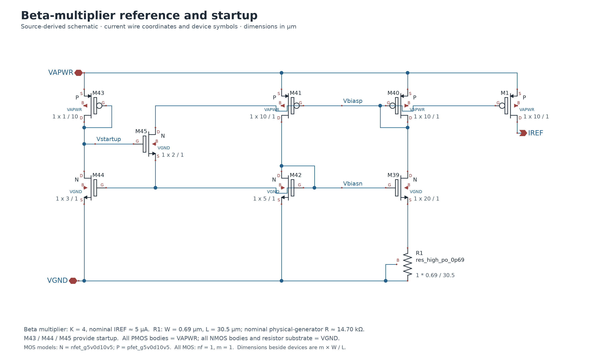
Figure 1. The actual reference and startup circuit. Dimensions are in µm. The reference's output transistor M1 is local to this subcircuit; it is not the main amplifier's input M1. VAPWR and VGND labels sit to the left of their connections.

For a long-channel square-law approximation, equal branch currents and negligible body effect give:

`I ≈ 2 / (β42 R1²) × (1 − 1/√K)²`, with `K = β39/β42 = 4` and `β42 = µn Cox W42/L42`.

This equation is useful for choosing a starting point. It says that increasing R reduces current, and increasing K raises it. It is not an accurate final sizing equation for these SKY130 devices. M39 has a raised source but its body stays at ground, so body effect matters. The PMOS mirror sees different drain voltages. The resistor model includes its actual process behavior. Even nominally identical current copies need not carry exactly the same current.

### Why 5 µA, and why these sizes?

The 5 µA value came from the reference already built for this project. It was retained as the unit current for the small-signal bias branches. That gives a modest supply budget while allowing roughly 60 µS of combined input transconductance in this implementation. It is a design choice, not a special current required by Fig. 7.7.6. A lower current could save power but would generally reduce speed or require different widths; a higher current would require rechecking compensation, noise, swing and power together.

The reference uses M42 = 5/1 µm and M39 = 20/1 µm, making K = 4 explicit. M40/M41 and the output copy each use 10/1 µm. Their equal geometry defines the nominal mirror ratio. The resistor is the high-poly 0.69 µm family, with length 30.5 µm. The physical generator's nominal value is about 14.70 kΩ; the simulated DC ratio V(R1)/I(R1) at 25 °C is about 15.37 kΩ. These are different definitions and should not be substituted for each other.

The practical sizing sequence is: choose a realizable matched ratio, estimate a resistor, simulate the actual model, then adjust the resistor and check the reference under its intended load. Here, one diode-connected 5/1 µm NMOS represents the master receiving IREF. The following sweep checks that choice directly.

| Change from the chosen reference | Final IREF at 25 °C, 3.3 V |
| --- | --- |
| Chosen: K=4, resistor L=30.5 µm | 4.977 µA |
| Resistor L=20 µm | 8.441 µA |
| Resistor L=45 µm | 3.186 µA |
| K=2, resistor unchanged | 2.698 µA |
| K=8, resistor unchanged | 7.345 µA |

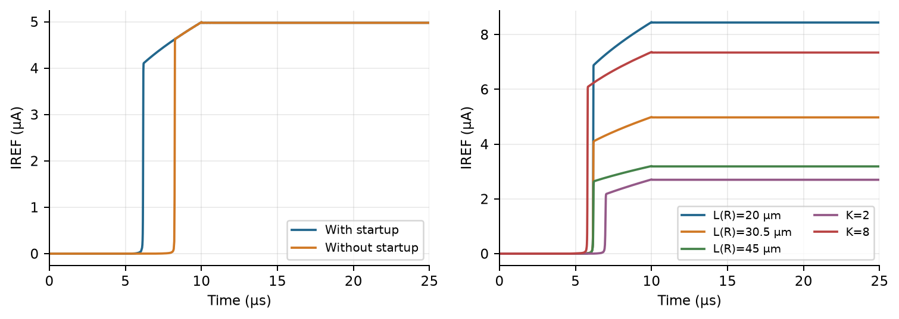
Figure 2. Standalone reference, one diode-connected NMOS load, 0–3.3 V supply ramp over 10 µs, zero-state UIC. Left: startup present or removed. Right: resistor length or NMOS ratio changed individually; other dimensions stay fixed. Values in the table use the settled 80 µs endpoint.

With the chosen dimensions, the model gives 4.977 µA at the output and 4.586 µA in the resistor branch. The resistor drop is 70.47 mV. The difference between those currents is a reminder to use the actual output-copy current as IREF. A square-law calculation alone would miss that distinction. Choosing K = 2 or 8 can also reach useful currents, but would require a different resistor and another startup/headroom check. The present K = 4 arrangement already supplies the intended bias budget.

### Leaving the zero-current state

Self-bias introduces a second possible equilibrium: everything off. M43 is a weak, diode-connected PMOS that raises Vstartup while the reference is off. M45 then connects the two bias-control nodes and disturbs that condition. As Vbiasn rises, M44 pulls Vstartup down and turns the bridge off. NMOS bodies remain at VGND and PMOS bodies at VAPWR, including M45; the lifted source is not its body connection.

The left-hand comparison in Figure 2 also starts without the three startup transistors. That nominal model still reaches about 5 µA during this ramp. Leakage and the supply ramp provide enough disturbance in this particular test. This is not evidence that startup is dispensable across devices, temperature and supply histories. Nor does the comparison show a startup failure that did not occur. The implemented circuit keeps its deliberate startup path.

Separate complete-amplifier tests include 1, 10 and 100 µs supply ramps at TT, 27 °C, plus a 10 µs ramp at SS, −40 °C and 3.0 V. All eight schematic/layout runs reached their reference-current and output criteria without a forced bias. For the nominal 10 µs ramp the additional delay was about 0.06 µs in both representations. The reference bridge becomes negligible in steady state; the M43/M44 branch still draws roughly 2.82 µA at the archived nominal point. Startup has a small continuing power cost.

### Does the reference stay at 5 µA in everyday use?

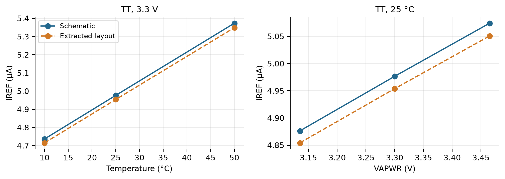
Figure 3. IREF measured in the complete amplifier. Left: 10, 25 and 50 °C at 3.3 V. Right: 3.135, 3.3 and 3.465 V at 25 °C. TT models, 20 pF, no DC load. The command follows VAPWR/2 in the supply sweep. The connecting lines join measured points, not a continuous sweep.

| Condition | Schematic IREF (µA) | Layout IREF (µA) |
| --- | --- | --- |
| 10 °C, 3.3 V | 4.737 | 4.715 |
| 25 °C, 3.3 V | 4.977 | 4.954 |
| 50 °C, 3.3 V | 5.374 | 5.349 |
| 25 °C, 3.135 V | 4.876 | 4.854 |
| 25 °C, 3.465 V | 5.074 | 5.051 |

These are modest laboratory/indoor-to-warm-enclosure test points, not a guarantee for every everyday application. The stronger variation is with temperature. This is a nominal bias reference, not a bandgap or a temperature-compensated precision current source. The question for the amplifier is whether that variation causes unacceptable gain, settling or operating-point changes; Section 6 returns to it.

## 2. Building the amplifier around that current

The book's compact GA–CF–GA arrangement combines signal-to-current conversion, current transfer/summing and output drive. In this implementation the complementary input pairs generate signal currents, the cascode mirror branches combine them and provide high-impedance gate-drive nodes, and the complementary output devices turn those gate signals into load current. The class-AB control and compensation connect these functions. Transistor numbers below follow this project's schematic, not an assumed one-to-one numbering with the book.

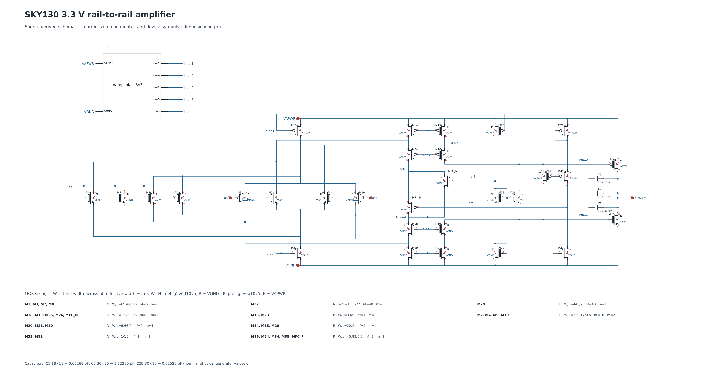
Figure 4. The complete amplifier. diffout is OUT. The signal path, replicas, floating-current path and Miller connections are shown with the actual current schematic. An enlarged vector drawing follows in the PDF.

### Complementary inputs: coverage first, uniform gm second

M1/M3 are the NMOS input pair, supplied by tail sink M22. M9/M10 are the PMOS pair, supplied by M13. A single NMOS pair loses useful transconductance near ground because its tail needs voltage headroom. A PMOS pair covers that end of the range. The NMOS pair covers the upper end. Putting both in parallel solves the coverage problem, but both conduct around the middle, which can make their combined gm nearly twice the edge value.

M7/M8 and M2/M4 are the spillover devices. Their gates see the midpoint bias. As common mode moves through the handover, these devices steer some tail current away from the signal devices. The intention is to reduce the central gm increase without abandoning complementary inputs.

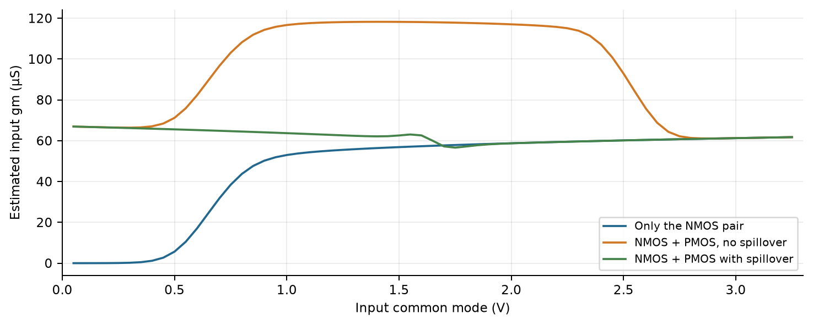
Figure 5. Newly simulated input-stage comparisons using the actual input/tail dimensions and real bias block. Both signal gates track the swept common-mode voltage. Drains are ideally clamped to their respective supply rails to isolate the input-current mechanism. These clamps are testbench elements. This is not a full-amplifier comparison.

The estimated input gm is half the sum of the intrinsic gm values of the signal devices. That is the small-signal differential-input estimate for this comparison; it is not output transconductance. From 0.3 to 3.0 V common mode, the complementary pair without spillover has a maximum/minimum ratio of 1.94. With spillover it falls to 1.17. The NMOS-only curve shows why a simpler single-pair input would give up low-common-mode coverage.

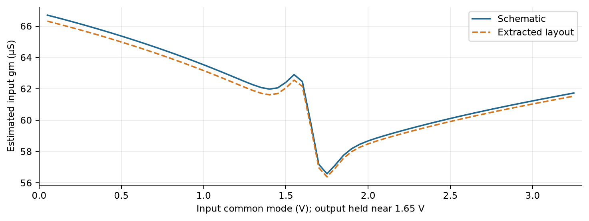
Figure 6. The same intrinsic-gm estimate in the complete amplifier, with output held near 1.65 V by a DC feedback level shift. The extracted curve sums all 50 physical signal-input fingers. Common-mode sweep: 0.05–3.25 V; the stated uniformity metric uses 0.3–3.0 V.

After layout, the estimated gm ranges from 56.39 to 65.61 µS over 0.3–3.0 V: a 1.164 maximum/minimum ratio, or 15.1% peak-to-peak relative to the midpoint of those extrema. The steering clearly helps. Calling the result exactly constant-gm would go too far. A tighter requirement would call for another round of steering-ratio/midpoint optimization and verification across common mode, process and temperature.

The input widths are 69.44/0.5 µm for each NMOS group, nf = 5, and 229.17/0.5 µm for each PMOS group, nf = 10, m = 2. Each spillover group matches its corresponding input geometry. The wider PMOS devices compensate for their lower transconductance per unit width at the selected current. A first estimate for one active pair is gm ≈ Itail/Vov: 5 µA and 60 µS suggest an effective overdrive around 80 mV. At such a small value, sizing from the actual model's gm/current curves is more useful than trusting a strong-inversion square law. Width is adjusted to the wanted gm at the chosen current, then the complementary handover is checked as in Figures 5 and 6. The 6 µm tail lengths help make their current less sensitive to drain voltage. This report validates the chosen sizes; it does not claim they are the unique optimum for noise, mismatch and speed.

### Cascode mirrors: gain costs headroom

The NMOS signal currents enter the PMOS mirror branch M14/M15 with cascodes M24/M16. The PMOS signal currents enter the NMOS mirror branch M20/M21 with M18/M19. The cascodes reduce changes in the mirror devices' drain voltages as the output-side nodes move. Less current error and higher output resistance help create voltage gain at the output-transistor gate-drive nodes.

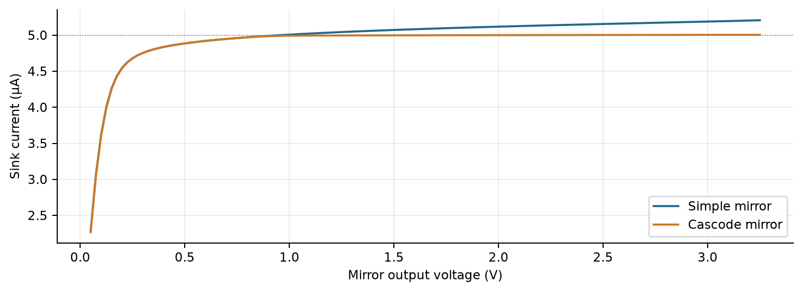
Figure 7. Standalone NMOS mirror experiment: a 5 µA ideal testbench master, the actual 6.66/2 µm mirror geometry and 13.89/0.5 µm cascode geometry, and a swept output voltage. It illustrates output resistance and compliance; it is not a replacement amplifier or an ablation of the complete folded branches.

Between 1.5 and 2.5 V, the measured slope corresponds to about 12.2 MΩ for the simple mirror and 204.9 MΩ for the cascode. The cascode current is flatter once sufficient headroom exists. Near ground, the extra device makes compliance harder. A simpler two-stage amplifier could use fewer transistors and lower internal headroom; reaching the same gain, input coverage and output swing would require its own design. The present branches preserve the book's architecture while the replica biases adapt their headroom to SKY130.

The mirror groups use L = 2 µm, while their common-gate cascodes use L = 0.5 µm. Longer mirror channels help output resistance. Shorter cascodes provide gm without another large gate capacitance. Their gate voltages must place the underlying mirror devices at sensible drain voltages; merely copying a voltage from the 2 V book circuit would not establish that at 3.3 V.

### Class AB: idle current and load current are different

PMOS M29 sources current from VAPWR; NMOS M32 sinks current to VGND. M26/M35 couple the two gate-drive sides. The replica stacks M23/M25/M30 and M31/M34/M28 establish the internal class-AB control voltages. The output pair retains a finite idle current, and feedback moves the gate drives when the load asks for much more current.

MFC_N/MFC_P form the complementary floating-current copy between internal reference buses. Its current is established by the surrounding circuit and device voltages. It is not another externally imposed 5 µA sink or source. Its nominal archived current is about 4.72 µA. This distinction matters when replacing ideal sources: forcing every visible branch to IREF would overconstrain the class-AB loop.

At the archived 27 °C nominal point the output devices each carry about 162 µA. Those are the two ends of the same supply-to-ground idle path; adding them would double-count the current. A class-A output biased at only a few µA would be much simpler but could not sustain 1 mA in both directions. Class AB provides that larger drive with a lower idle budget than a permanently 1 mA class-A path. That comparison is a current-budget argument, not a simulated alternative amplifier.

The chosen output dimensions are M29 = 440/2 µm and M32 = 133.2/2 µm, each with 40 fingers. W is the total width of one instance, so their per-finger widths are 11 and 3.33 µm. For input devices with m = 2, effective repeated width is mW. Multiplying W by nf again would count the width twice.

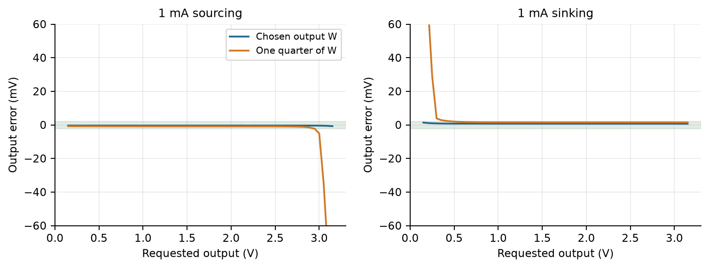
Figure 8. Full schematic versus the same schematic with output W reduced to one quarter; all other devices and compensation unchanged. A DC feedback level shift holds input common mode near 1.65 V while sweeping the requested output. Load is +1 mA out of OUT for sourcing, then −1 mA for sinking. Shading marks ±2 mV tracking error. This comparison checks drive/headroom, not the smaller version's complete stability.

On the sampled 0.15–3.15 V interval, the chosen widths meet the ±2 mV criterion throughout both load directions. With quarter-width devices the accepted source interval ends near 2.90 V and the sink interval starts near 0.50 V. The chosen widths buy useful rail headroom at this current. The cost is larger area and gate capacitance, which the preceding stages must drive. Reducing channel length would also change output resistance, idle bias and compensation; it is not a free speed improvement.

### Miller compensation: sacrificing excess bandwidth for usable feedback

There is more than one high-impedance internal node. Without compensation, accumulating phase lag can make unity feedback unstable before the loop gain drops below one. The three MIM capacitors return output motion to the source-side cascode nodes. C1 connects OUT to drain, the M16 source node. C2 and C2B connect OUT to net4, the M19 source node. They are not simply connected to the output transistor gates.

The chosen MIM dimensions are 18×18, 30×30 and 30×10 µm. Nominal generator values are approximately 0.662 pF for C1 and 2.438 pF for C2+C2B. Their unequal values reflect the unequal complementary paths.

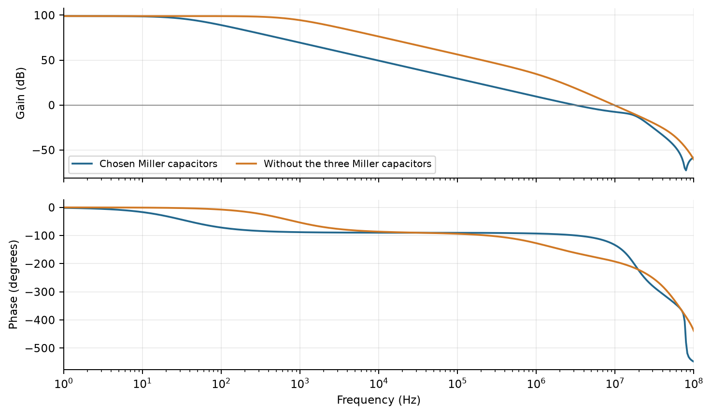
Figure 9. Unity-follower loop return ratio at TT, 25 °C, 3.3 V and 20 pF. Removing only C1/C2/C2B leaves the DC point nearly unchanged but changes the frequency response. The loop measurement preserves DC feedback and port loading.

With the chosen capacitors, schematic loop unity frequency is 3.09 MHz and phase margin is 80.6°. Removing them raises the crossing to 9.69 MHz but gives -11.8° phase margin and -7.2 dB gain margin. The uncompensated alternative is unsuitable for this unity-feedback condition. More capacitance could add margin at the expense of speed and area; less could recover bandwidth while reducing the load margin. Load and step tests, rather than bandwidth alone, decide whether the chosen balance is useful.

## 3. Turn the ideal biases into real circuits

IREF is used once to establish a master gate voltage. Its receiving device, MBN, is diode-connected. NMOS copies then get that gate voltage and produce separate currents in separate branches. One NMOS master copy drives a diode-connected PMOS master, which provides the complementary set of PMOS copies. This is how a single reference can serve several consumers without dividing its original current unpredictably.

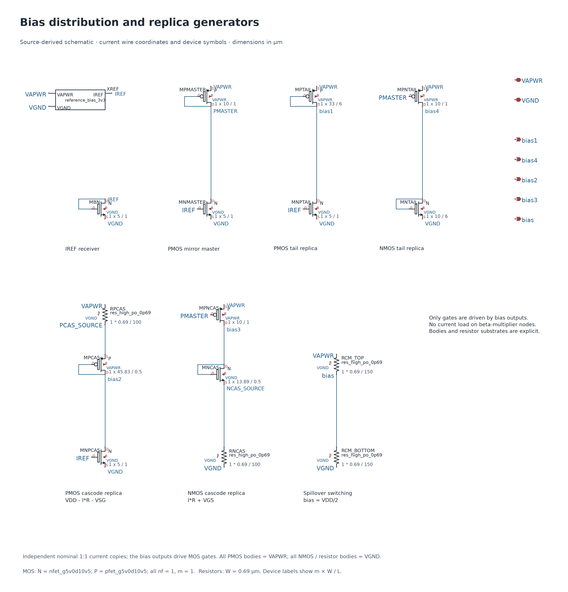
Figure 10. The real bias tree. The reference output feeds one master. Independent mirror devices supply the current-consuming replicas. Sharing a gate voltage is appropriate; sharing one current-output node between several independent consumers is not equivalent.

| Node | How it is generated and what it biases |
| --- | --- |
| bias1 | A PMOS tail replica MPTAIL, sunk by an independent NMOS mirror; gates of M13/M23. |
| bias4 | An NMOS tail replica MNTAIL, fed by an independent PMOS mirror; gates of M22/M31. |
| bias2 | PMOS cascode replica plus RPCAS source shift; gates of M24/M16. |
| bias3 | NMOS cascode replica plus RNCAS source shift; gates of M18/M19. |
| bias | An equal-resistor supply midpoint for the spillover gates. |

The tail replicas use the same dimensions as the tails: PMOS 33/6 µm and NMOS 10/6 µm. The cascode replicas use the appropriate polarity and geometry. RPCAS/RNCAS are 100 µm high-poly resistors, approximately 46.91 kΩ by the physical generator. Their voltage drops shift the replica operating points. The midpoint uses two 150 µm resistors. Its roughly 22.2 µA divider current is part of the power budget; it is not another copy of 5 µA.

At the archived nominal extracted point, bias1/bias4 are 2.054/1.047 V, bias2/bias3 are 2.046/1.139 V, and the midpoint is 1.650 V. Actual PMOS and NMOS input tails are about 5.25 and 5.73 µA. Those deviations from IREF come from different device voltages, body effects and mirror compliance. The target is correct operation of each branch, not equal current numbers everywhere.

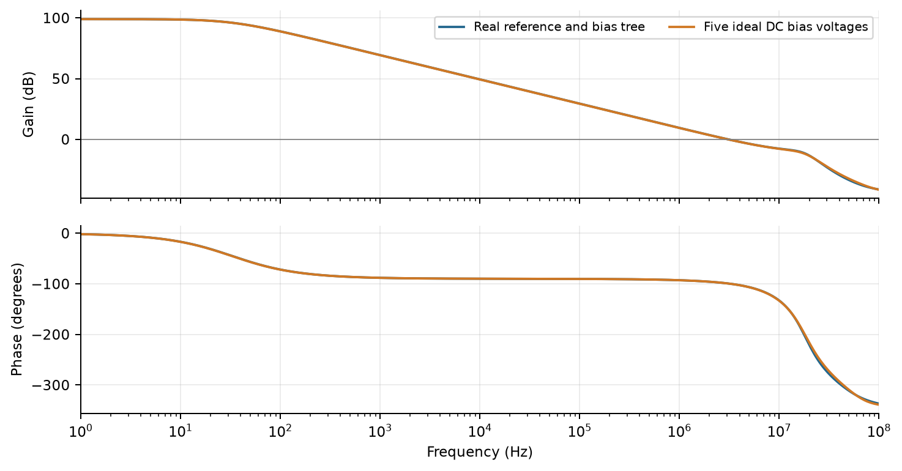
Figure 11. Schematic open-loop voltage gain with the real reference/tree and with five fixed ideal bias voltages replacing that block. The ideal values are taken from the earlier nominal DC solution. Both tests use 3.3 V, 25 °C and 20 pF. The ideal circuit is a private teaching experiment and is not the submitted design.

The similar nominal gain curves show that the real tree reproduces the intended small-signal operating point. They do not show immunity to supply, temperature or mismatch. The ideal version also draws current from hidden ideal sources, so its VAPWR reading would be an unfair power comparison. The real amplifier contains no ideal bias source. All PMOS bodies connect to VAPWR and all NMOS bodies to VGND, including lifted-source replicas and floating-current devices.

## 4. What the layout adds


Figure 12. Final layout in the 145.360×225.760 µm 1x2 template. Wide devices are divided into fingers; wells and substrate contacts implement the body connections. KIT and Marvin occupy the free artwork region.

The schematic defines which terminals share a net. The layout adds the actual junction dimensions and the resistance and capacitance of the conductors. Those changes can move bias points and poles even when LVS confirms the same circuit. This is why every important performance plot compares schematic and extraction under the same testbench.

Metal1 through metal4 are used. Metal5 is reserved for shuttle infrastructure and is absent from this design. Hierarchical Magic DRC and GDS readback report zero errors, LVS matches uniquely, the antenna check is clean, and all 15 official prechecks passed on the final exported layout. These are physical/interface checks, not proof of analog performance.

An [interactive 3D layout viewer](https://marvinbrth.github.io/ttsky26d-analog-opamp-rrio-cgm/) is linked in the README as well. It uses the generated OAS layout and the Tiny Tapeout GDS viewer. The final GDS is unchanged by this documentation revision.

## 5. Setting up the simulations

### DC and ordinary closed-loop tests

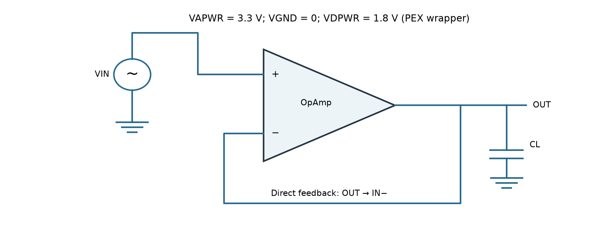
Figure 13. The ordinary follower testbench. Direct OUT-to-IN− feedback is correct for DC, signal AC transfer and transient response. The capacitor represents the specified output load. Supplies are omitted from the amplifier symbol but stated above it.

A straight feedback wire is exactly what a normal unity follower needs. For AC signal transfer, VIN has its DC value plus AC = 1; ngspice linearizes the transistor circuit at that DC operating point. AC = 1 is a transfer-function normalization, not a physically applied 1 V large-signal swing. For a step test, VIN instead receives the specified time waveform. A zero-volt source can replace the wire if a current measurement or later injection needs it; it is still a DC/AC short when its stimulus is zero.

Before trusting a frequency plot, check the DC solution: OUT near the intended command, IREF active, plausible supply current and device terminal voltages. A converged solution can still be the wrong equilibrium. A nodeset is only a starting guess and is not startup evidence. Startup is tested separately from a zero-state transient.

### True open-loop gain while keeping the DC point

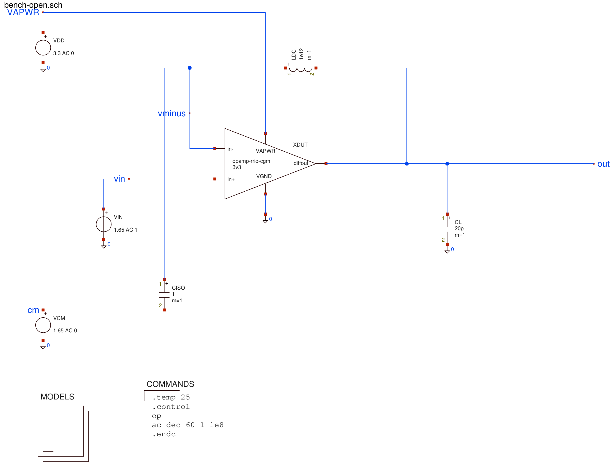
Figure 14. The open-loop voltage-gain test. LDC is a DC short but effectively open over the AC sweep. CISO is a DC open and holds IN− at AC ground through the fixed common-mode source. Both are ideal testbench devices, never physical on-chip elements.

If feedback is simply disconnected, a tiny input offset can drive the high-gain amplifier to a rail. The resulting AC linearization then describes a saturated circuit. LDC = 10¹² H closes the loop at DC; CISO = 1 F fixes IN− for AC. At the lowest swept frequency, 1 Hz, those impedances already separate the two jobs by many orders of magnitude. Gain is calculated as `Aol = V(OUT)/(V(IN+) − V(IN−))`, using the actual differential voltage rather than assuming it is exactly one. The open and closed testbench DC outputs agree within 2 µV in these runs.

### Stability requires a loop measurement

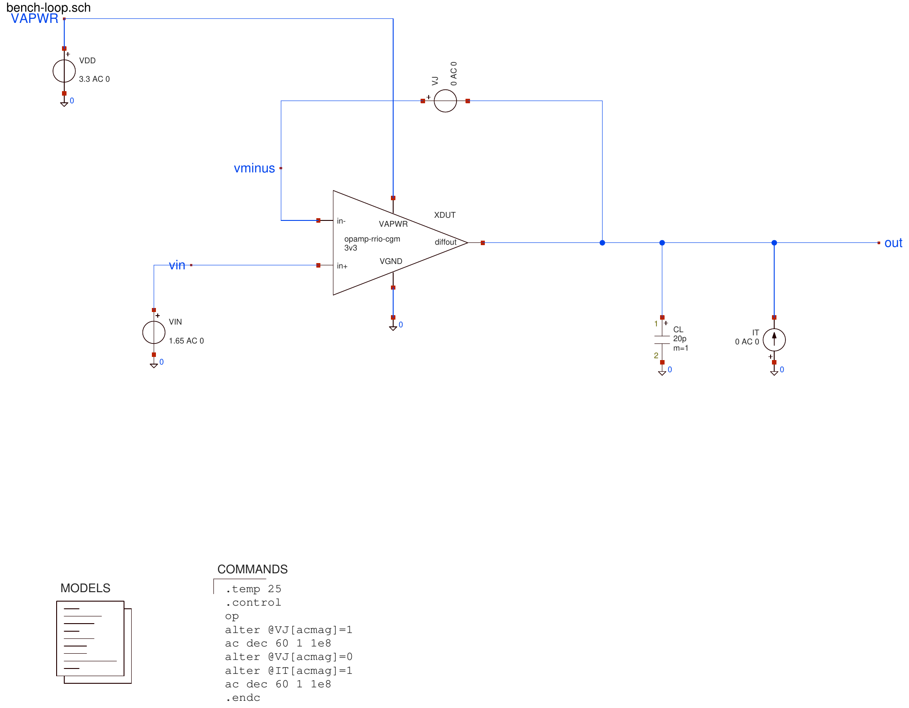
Figure 15. Two-injection return-ratio measurement at the follower feedback port. VJ has zero DC voltage; IT has zero DC current. One AC run excites VJ, another IT. The signal source has AC = 0 in both. Normal signal transfer is a third run with both injection stimuli zero.

Open-loop voltage gain and loop return ratio are related but not identical. Finite reverse transmission and loading at the injection point can matter. The two-injection calculation retains the circuit on both sides of that port and gives the return ratio used for phase and gain margins. For the source orientations shown, vv and iv are V(OUT) and I(VJ) from the 1 V injection; vi and ii are the same responses from the 1 A injection. All four are complex frequency responses, normalized by their respective test stimulus. IT points from ground into OUT, and positive I(VJ) points from IN− to OUT. The saved responses produce the plotted return ratio with:

```
k = 2 × (iv × vi − ii × vv) − ii − vv
T = k / (1 − k)
```

The phase margin is 180° plus loop phase at a downward unity crossing; gain margin is the distance below unity at a −180° phase crossing. Multiple crossings are checked rather than selecting the most favorable one. Do not change injection directions without adapting the sign convention.

The frequency sweep uses 60 points per decade from 1 Hz to 100 MHz. A negative margin is a failure of the tested feedback condition, even if an AC plot still looks smooth. A useful closed-loop magnitude curve and a settling transient provide complementary checks. They are not substitutes for each other.

### Separate common mode from output swing

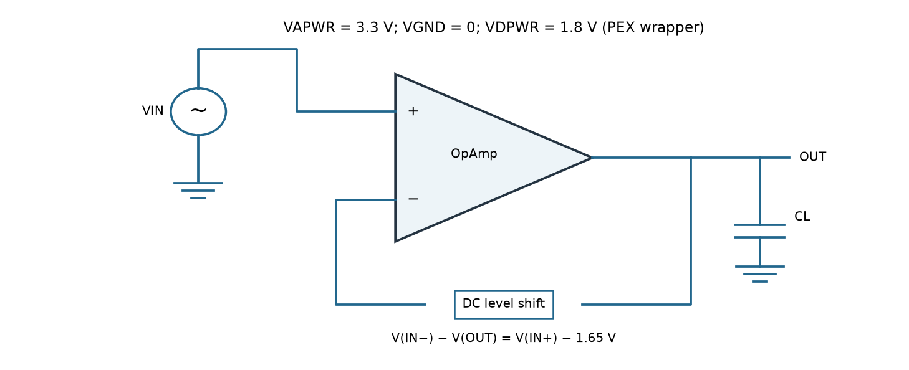
Figure 16. A DC level shift keeps OUT near 1.65 V while moving both inputs through the common-mode range. The behavioral source obeys V(IN−)−V(OUT) = V(IN+)−1.65 V. It exists only in the testbench.

A follower sweep moves input common mode and output voltage together. If it fails near a rail, it cannot by itself say whether the input stage or the output lost headroom. For the common-mode test above, OUT remains near mid-supply. Conversely, the output-range test keeps IN+ at 1.65 V and uses a level shift with the swept output command. These two tests isolate the limits that a single follower sweep combines.

## 6. How the complete amplifier performs

### Open loop, then closed loop

| Quantity: TT, 25 °C, 3.3 V, 20 pF | Schematic | Extracted layout |
| --- | --- | --- |
| Settled OUT (V) | 1.650008 | 1.649973 |
| IREF (µA) | 4.977 | 4.954 |
| Supply current (µA) | 259.81 | 258.72 |
| Analog idle power (mW) | 0.857 | 0.854 |
| Open-loop gain at 1 Hz (dB) | 99.01 | 98.94 |
| Loop unity frequency (MHz) | 3.086 | 3.100 |
| Loop phase margin (degrees) | 80.56 | 79.55 |
| Loop gain margin (dB) | 10.01 | 9.36 |

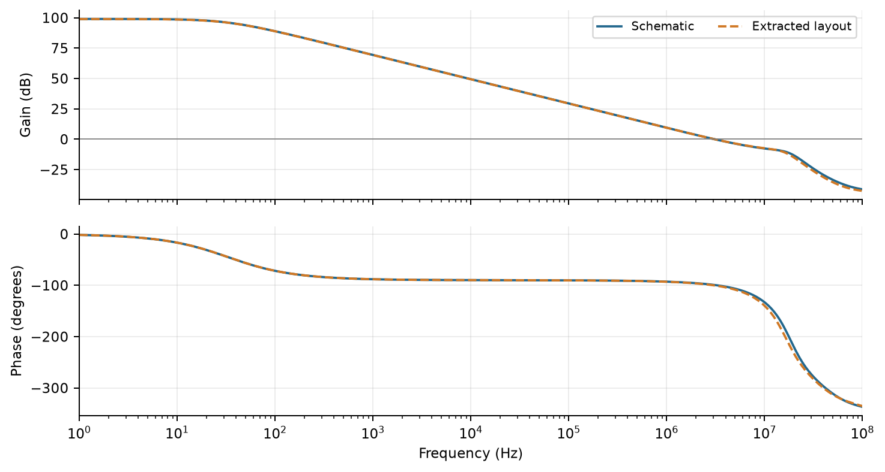
Figure 17. True open-loop voltage gain before and after layout. TT, 25 °C, 3.3 V, input common mode 1.65 V, 20 pF and no DC load. Margins in the table come from the separate loop-return-ratio test, not by relabeling this transfer as loop gain.

The layout barely changes low-frequency gain and unity-loop frequency here. That agreement is encouraging but does not imply every parasitic effect is small; supply rejection later in this chapter provides a counterexample. The nominal output error is the settled deterministic follower error. It is not a mismatch offset specification.

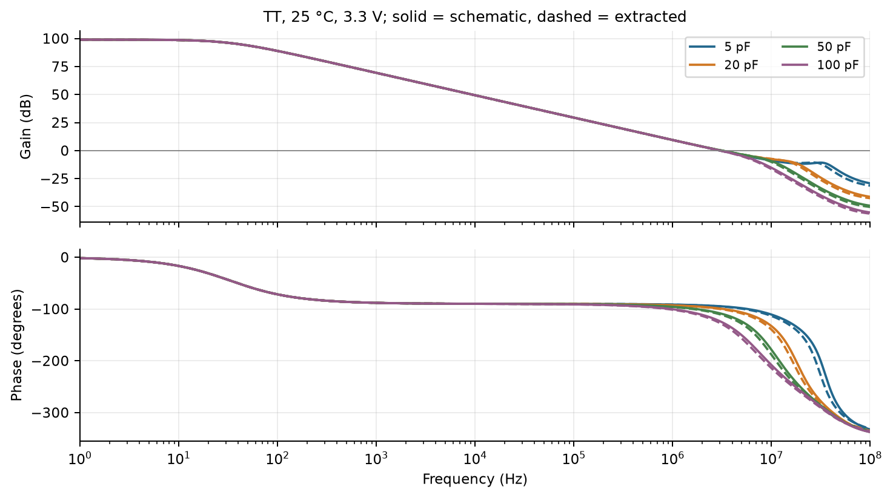
Figure 18. True open-loop gain for 5, 20, 50 and 100 pF, with schematic and layout overlaid. TT, 25 °C, 3.3 V, no DC load. Colors identify load; line style identifies representation.

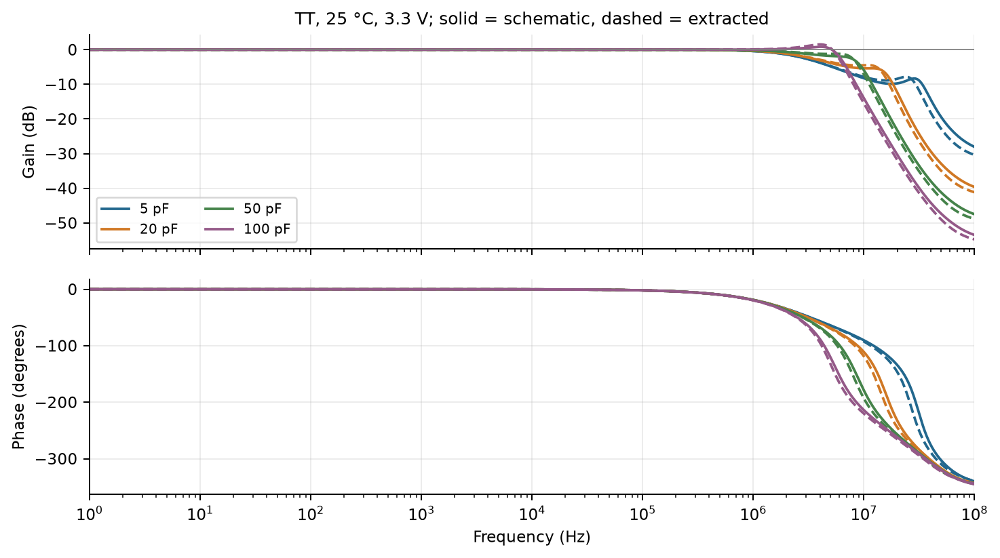
Figure 19. Signal transfer of the unity follower under the same load conditions. A rise above 0 dB indicates frequency peaking. It is distinct from step overshoot.

| CL (pF) | Phase margin, schematic/layout (°) | Gain margin, schematic/layout (dB) | Peaking, schematic/layout (dB) |
| --- | --- | --- | --- |
| 5 | 85.3/84.8 | 12.19/11.27 | 0.00/0.00 |
| 20 | 80.6/79.6 | 10.01/9.36 | 0.00/0.00 |
| 50 | 70.6/68.4 | 9.57/8.98 | 0.00/0.00 |
| 100 | 56.1/52.9 | 9.44/8.87 | 0.82/1.52 |

The capacitor changes output dynamics much more than the DC bias. At 100 pF, the nominal extracted phase margin is 52.9° and the closed-loop peak is 1.52 dB. Both loop margins are positive, but the higher peaking and lower phase margin make this a weaker result than at 20 pF. These additional nominal load checks do not qualify all four loads across common mode, corners, mismatch and the shuttle's external switch path. The principal multi-condition qualification remains 20 pF. The four archived interface cases, including switch/resistance and 5 pF path loading, had a lowest phase margin of 60.92° and a maximum closed-loop peak of 0.688 dB. Board wiring and instruments still need an explicit capacitance budget.

### Input range and available output current

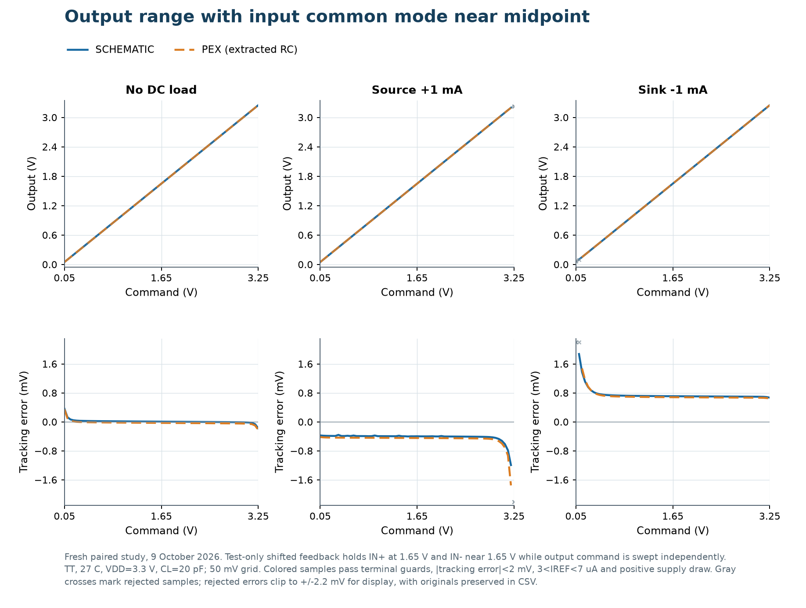
Figure 20. Separate fixed-input-common-mode output sweeps, before and after layout, at TT, 27 °C and 3.3 V. No load and ±1 mA demand are shown. The earlier DC suite uses 50 mV sample spacing and a ±2 mV tracking criterion.

The separate unloaded common-mode test passes from 0.05 to 3.25 V on that sampled grid. It demonstrates operation close to both rails without requiring the output to follow them. The unloaded fixed-common-mode output test also passes 0.05–3.25 V. At 1 mA, the extracted source interval is 0.05–3.20 V and the sink interval is 0.15–3.25 V. A follower imposes both limits together and passes 0.05–3.15 V sourcing and 0.15–3.25 V sinking.

These results support the rail-to-rail architecture in a practical sense: both input and output work near the rails. They do not establish exact-rail regulation or zero headroom at arbitrary current. The 50 mV grid also limits the precision of each quoted endpoint. ±1 mA is the tested useful demand, not a measured current limit or a short-circuit rating. Sourcing and sinking are asymmetric, and the shuttle switch adds voltage drop between core OUT and the external pin.

### A 50 mV step, then a large step

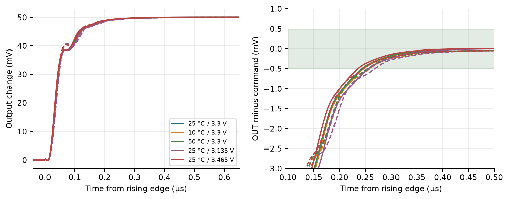
Figure 21. Unity-follower 50 mV rising step at the five ordinary supply/temperature conditions. Input edge: 1 ns. Left: output change relative to its pre-step value. Right: absolute error from the command, with a ±0.5 mV settling band. 20 pF, no DC load; solid schematic, dashed extraction. Falling steps are included in the table.

| Condition | Layout rise/fall (ns) | Schematic settle up/down (µs) | Layout settle up/down (µs) |
| --- | --- | --- | --- |
| 10 °C, 3.3 V | 100 / 96 | 0.246 / 0.234 | 0.259 / 0.233 |
| 25 °C, 3.3 V | 100 / 96 | 0.244 / 0.232 | 0.257 / 0.231 |
| 50 °C, 3.3 V | 100 / 94 | 0.244 / 0.232 | 0.255 / 0.229 |
| 25 °C, 3.135 V | 102 / 100 | 0.256 / 0.242 | 0.269 / 0.241 |
| 25 °C, 3.465 V | 96 / 90 | 0.236 / 0.224 | 0.247 / 0.221 |

Rise/fall time means the measured 10–90% transition. Settling begins after the input edge ends and requires the error to enter and remain within ±0.5 mV of the command until the next edge. That is 1% of a 50 mV step, not 1% of the 1.65 V operating level. The nominal layout rise is about 100 ns; rising-edge settling is 0.257 µs. The finite timestep is 2 ns, so reporting excessive digits would be misleading.

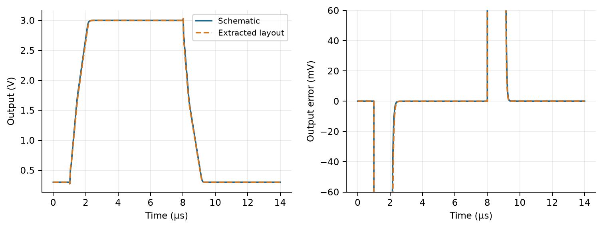
Figure 22. 0.3→3.0→0.3 V follower command at TT, 25 °C, 3.3 V and 20 pF, no DC load. Input edges: 10 ns. The right panel enlarges output error; it clips the large initial tracking error for readability, not for the settling calculation.

| Representation / transition | 10–90% time (µs) | 1% settling (µs) | Overshoot (mV) |
| --- | --- | --- | --- |
| Schematic; rise | 0.920 | 1.180 | 0.000 |
| Schematic; fall | 0.977 | 1.183 | 0.000 |
| Extracted layout; rise | 0.968 | 1.207 | 0.000 |
| Extracted layout; fall | 0.968 | 1.169 | 0.000 |

The large-step criterion is ±27 mV, 1% of the 2.7 V excursion, and differs from the small-step criterion. It includes the nonlinear charging and recovery of the output and internal nodes. Small-signal unity frequency alone cannot predict this response. These tests do not assign a single universal slew-rate number, and they do not establish the same large-step behavior while delivering 1 mA.

### What changes over the ordinary supply/temperature window?

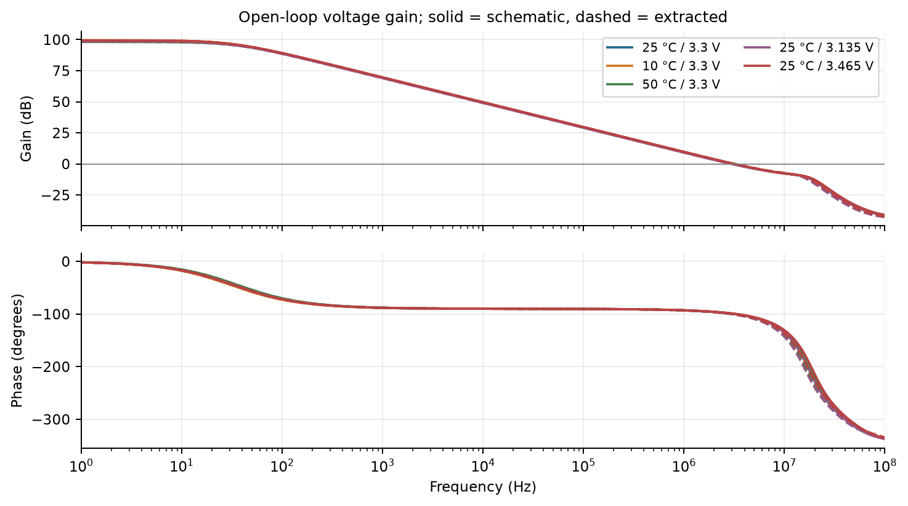
Figure 23. Open-loop voltage gain at 10, 25 and 50 °C with 3.3 V, and at 3.3 V ±5% with 25 °C. Each curve changes one condition from nominal. TT, 20 pF, no DC load. Colors identify conditions; solid/dashed identify schematic/extraction.

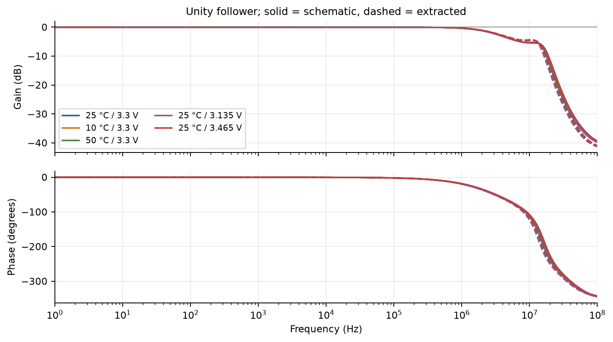
Figure 24. The corresponding follower signal transfer. The curves remain close to unity at low frequency despite the reference and supply-current changes. This is a command-transfer test; it does not inject supply noise.

| Condition | Layout Iq (µA) | Aol at 1 Hz (dB) | Loop unity (MHz) | Phase margin (°) |
| --- | --- | --- | --- | --- |
| 10 °C, 3.3 V | 246.7 | 99.43 | 3.094 | 79.57 |
| 25 °C, 3.3 V | 258.7 | 98.94 | 3.100 | 79.55 |
| 50 °C, 3.3 V | 278.8 | 98.14 | 3.109 | 79.53 |
| 25 °C, 3.135 V | 246.6 | 98.59 | 2.991 | 79.61 |
| 25 °C, 3.465 V | 270.7 | 99.27 | 3.207 | 79.49 |

At low frequency, feedback largely absorbs the bias changes. Bandwidth, current and settling still move. The reference variation in Section 1 therefore does not translate directly into the same percentage of output-voltage error. Supply-sweep commands follow half the supply, so their common mode changes too. To measure a disturbance from the supply itself, keep the command fixed, as in the following test.

### Supply disturbances and fast load changes

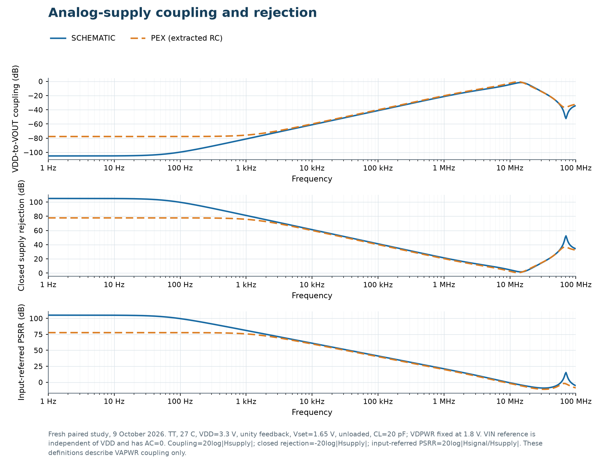
Figure 25. Positive-rail rejection at TT, 27 °C, 3.3 V, fixed 1.65 V command and 20 pF. The earlier paired test separately measures signal and supply transfer. Closed rejection is −20 log10|Hsupply|; input-referred rejection is 20 log10|Hsignal/Hsupply|.

At 10 Hz, closed-loop rejection falls from 104.94 dB in the schematic to 77.70 dB after layout. This roughly 27 dB loss is a material parasitic/physical effect, despite the small change in nominal gain. At 100 kHz the results are around 40–41 dB. Positive-rail ±0.1 V, 100 ns steps give about 13.5–14.8 mV peak output error after layout, recovering to the ±2 mV band in about 0.05–0.11 µs. These figures cover this rail and follower boundary condition, not a complete two-rail PSRR characterization.

A fast load step is more demanding than a settled DC load. The earlier 10 ns ±1 mA applications give about 374 and 462 mV peak excursions after layout, followed by recovery to ±2 mV in approximately 0.30 and 0.42 µs. Load removals can also produce a large excursion. The amplifier can supply 1 mA after settling; it is not a stiff voltage source during an abrupt 1 mA transition. Applications requiring small load-step glitches need that limitation addressed explicitly.

## 7. Process corners and Monte Carlo answer different questions

### What FF means

TT is the typical transistor model. FF moves the NMOS and PMOS models to their fast process cases together; SS uses both slow cases. SF and FS test opposite NMOS/PMOS directions, in that order. They are useful because the amplifier depends on complementary paths whose tracking can change. “Fast” does not mean “best”: higher gm or shifted poles can reduce a particular loop margin, while another corner can limit headroom.

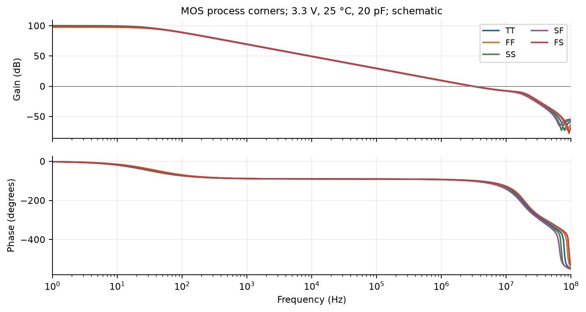
Figure 26. Schematic loop return ratio for TT/FF/SS/SF/FS at 3.3 V, 25 °C, 20 pF and no DC load. Process is changed separately from temperature and supply. Typical passive models are retained; this is a MOS-corner comparison, not an exhaustive passive-corner sweep.

| Corner | IREF (µA) | Loop gain (dB) | Unity (MHz) | PM (°) | GM (dB) |
| --- | --- | --- | --- | --- | --- |
| TT | 4.977 | 99.01 | 3.086 | 80.56 | 10.01 |
| FF | 4.820 | 97.70 | 3.081 | 81.48 | 10.47 |
| SS | 5.134 | 100.24 | 3.095 | 79.46 | 9.59 |
| SF | 4.580 | 98.82 | 2.981 | 79.31 | 10.22 |
| FS | 5.386 | 99.03 | 3.198 | 81.43 | 9.89 |

These tests explain the process effect without mixing it with ordinary temperature drift. The earlier final-layout 42-case combined-PVT suite includes more severe supply/temperature/load points at the principal 20 pF load; its minimum phase margin is 71.52° and minimum gain margin 6.43 dB. That archive remains the broader deterministic qualification. A good FF result alone would not replace it.

### Local mismatch: nominally equal devices are not perfectly equal

Monte Carlo samples random model variations. Local mismatch can make two identically drawn input devices or mirror copies differ on the same die. A process corner moves device families coherently; it does not supply an input-offset distribution. Global random process variation and local mismatch are separate switches in the model library.

This report adds 64 schematic local-mismatch samples at TT, 25 °C, 3.3 V, 1.65 V follower command and 20 pF. The library enables MC_MM_SWITCH = 1 and leaves MC_PR_SWITCH = 0. Each sample uses a recorded seed from 70100 through 70163. The equivalent follower offset is 1.65 V minus the settled output. It includes the complete simulated circuit's mismatch contribution; it is not a standalone input-pair threshold mismatch measurement.

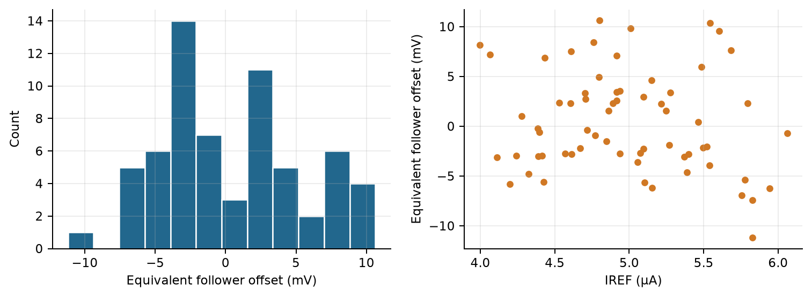
Figure 27. Local-mismatch sample distribution and its relation to IREF. These are schematic-model samples at one condition, not measured chips or a post-layout statistical yield estimate.

All 64 samples completed; 0 failed the recorded terminal-voltage guard. The equivalent follower offset has a sample mean of +0.398 mV and sample standard deviation of 5.036 mV. Observed extremes are -11.192 to +10.632 mV. IREF spans 3.996–6.060 µA. All 64 offset values differ; repeating seed 70100 reproduces the saved offset and IREF within the recorded numerical tolerance. These samples measure the nominal DC mismatch distribution; AC stability and startup were not rerun for every draw.

The roughly 5 mV sample standard deviation is much larger than the tens of µV seen in the deterministic nominal follower. Offset is therefore a practical limitation for precision DC use. A sub-millivolt requirement would need another design step: for example larger matched input area, different input operating current, or an offset correction scheme, followed by a fresh mismatch study. Increasing area can improve random matching but also adds capacitance; this report has not simulated those changes and does not promise their result.

The repeated-seed check tests reproducibility, and different seeds must actually produce different draws. A simulation that merely runs 64 times with identical randomized parameters would not be a Monte Carlo study. The finite sample size and single operating condition also rule out a production-yield claim. Schematic grouping, multiplicity and layout-finger correlations deserve separate checking before translating this distribution into a silicon specification. The present study does not model systematic gradients, layout stress, package effects or every passive mismatch source.

## 8. Return to the goals

| Original goal | Result |
| --- | --- |
| ✓ Self-generated reference and biases | Achieved in the tested conditions. About 5 µA nominal; independent mirrors and replicas replace ideal bias sources. Temperature drift remains. |
| ✓ Startup in the tested ramps | Passed the stated complete-amplifier ramps. Universal startup for every power sequence is not established. |
| ✓ Input close to both rails | Achieved on the sampled 0.05–3.25 V common-mode sweep with output held at mid-supply. |
| △ Constant gm | Improved substantially by spillover, but not exact: about 15.1% peak-to-peak variation over 0.3–3.0 V in the nominal extracted estimate. |
| ✓ Useful bidirectional output current | ±1 mA DC tested. Headroom and fast load-step excursions limit its use. No short-circuit rating is assigned. |
| ✓ Stable unity follower at the principal load | Passed the principal 20 pF deterministic suite; nominal layout margin about 79.6°. Larger-load results are condition-specific. |
| ✓ Ordinary supply and temperature tolerance | The stated ±5% / 10–50 °C cases retain operating points and stable loop margins. Current and dynamic behavior change as measured. |
| ✓ Tiny Tapeout area/interface | 1x2, three analog signals; DRC/LVS/antenna and official prechecks pass on the final exports. |

The checkmarks apply to the stated tests; the triangle marks partial achievement. The result is a self-biased amplifier with useful gain, near-rail operation and a tested 1 mA DC load capability. The strongest cautions are the reference's temperature dependence, finite gm variation, millivolt-scale simulated mismatch offset, positive-rail rejection loss after layout and large fast-load excursions. None should be hidden behind the rail-to-rail or constant-gm name. Noise, complete CMRR/two-rail PSRR, extensive mismatch across operating conditions and silicon measurements remain outside the present qualification.

### Models, data and reproduction

The simulations use ngspice 44 and SKY130 PDK release bdc9412b3e468c102d01b7cf6337be06ec6e9c9a. The schematic and extracted devices use nfet_g5v0d10v5/pfet_g5v0d10v5. Ordinary comparisons disable process/mismatch randomness. Local mismatch is enabled only in its dedicated library copy. The extracted circuit is derived from the final 8 October layout. Its reduced interconnect network was checked against the full nominal network; the maximum relative complex loop difference was 3.70×10⁻⁸ in that comparison.

DC guards inspect all 49 schematic device groups or 225 extracted MOS instances. They check plausible terminal voltages and the stated HV voltage limits; they do not claim every device is in saturation at every sweep point. The new common-mode/gm sweeps additionally inspect every saved DC point. Transient plots save selected signals and do not prove every-device transient stress. The earlier DC, startup, supply and load tests retain their separately recorded conditions; in particular their nominal temperature is 27 °C, whereas the new comparisons use 25 °C.

The plot data and measured metrics are under [docs/data](data/revision-summary.json). The testbench decks are retained under [docs/simulation](simulation/manifest.json), including the controlled teaching variants. From docs/simulation, run `python configure_models.py PATH_TO_SKY130A` to point the libraries at the pinned local PDK. Then run `ngspice -b test.spice` from a case directory. The mismatch template uses seed 70100; the other saved samples use 70101–70163. The data/deck hashes identify the individual simulations; they do not imply bit-for-bit equality between different machines or model versions. The only schematic edit made for this report mirrors two supply-pin symbols; electrical connectivity and the final layout exports stay unchanged.

Useful primary references are the [ngspice 44 manual](https://ngspice.sourceforge.io/docs/ngspice-44-manual.pdf), the [SKY130 device models](https://github.com/fossi-foundation/skywater-pdk-libs-sky130_fd_pr), the [pinned PDK release](https://github.com/chipfoundry/volare/releases/tag/sky130-bdc9412b3e468c102d01b7cf6337be06ec6e9c9a), and the [Tiny Tapeout analog specifications](https://tinytapeout.com/specs/analog/). The circuit reference is Huijsing, *Operational Amplifiers*, Fig. 7.7.6: the compact 2 V rail-to-rail input/output class-AB final approach with Miller compensation. This project's 3.3 V dimensions, reference and test results are its own SKY130 implementation.

# How to test

ua[0] is IN+, ua[1] is IN−, and ua[2] is OUT. VAPWR powers the analog circuit at 3.3 V, VDPWR is the separate 1.8 V shuttle supply, and VGND is common ground. Digital inputs are unused; digital outputs and bidirectional enables are tied low. ena does not shut down the internal reference. Project selection connects the external analog paths through the shuttle switches.

1. Select the project and apply both supplies with local decoupling. Begin without a DC output load and use a low-capacitance instrument.
2. Connect external OUT to IN−, apply 1.65 V to IN+, and wait for the supplies and output to settle. A 1 ms initial wait is a convenient measurement procedure, not a specified startup delay.
3. Record the output and supply current. A board-level current reading can include circuitry beyond the roughly 260 µA core.
4. Sweep the input slowly over 0.8–2.5 V first. Add controlled source and sink demand gradually toward 1 mA, recording the actual load and error.
5. Apply a 50 mV step near mid-supply and measure a small-signal frequency sweep. Include probe, cable and feedback-path capacitance in the load budget.
6. Change temperature and supply separately. For supply-rejection testing, hold the input command independent of the disturbed supply.

An open-loop chip output may saturate from a very small input difference. Begin in feedback. A resistor load draws a voltage-dependent current, unlike the constant-current simulation cases. The connector mapping comes from the selected analog board and should be checked before wiring.

# External hardware

An analog-capable Tiny Tapeout board, regulated 1.8 V and 3.3 V supplies, local decoupling, a DC/signal source, voltmeter and low-capacitance oscilloscope probe are enough for the first follower measurements. Controlled loads and frequency-response equipment extend the tests. No external reference, bias source or clock is required.
