# How it works

## 1. Design goals and achieved performance

The goal was a compact, self-biased operational amplifier with complementary rail-to-rail input stages and a class-AB output, based on Huijsing, *Operational Amplifiers*, Fig. 7.7.6. The circuit was adapted to SKY130 and the 3.3 V analog supply available on Tiny Tapeout. It should generate its own bias, occupy a 1x2 tile, use only IN+, IN- and OUT as external analog signals, and supply useful load current while retaining stable feedback operation.

The implemented amplifier meets the self-bias, area and interface goals. The reference supplies approximately 5 µA, with independent mirrors and replica devices generating the other biases. No ideal bias source remains inside the amplifier. Ideal stimulus, load and feedback-test sources appear only in simulation testbenches. The design uses three analog pins and a 145.360 x 225.760 µm template.

The electrical results below describe simulations of the schematic and final extracted layout. They are not silicon measurements or production specifications. The schematic curves use the schematic device and junction geometry. The post-layout curves use layout-derived device/finger and junction geometry together with extracted interconnect resistance and capacitance. Differences between them therefore include both geometry and interconnect effects. Both representations use the same SKY130 model configuration, stimuli and loads in each paired plot.

| Design goal | Outcome and practical boundary |
| --- | --- |
| Internal reference and reliable startup | Approximately 5 µA at nominal conditions; startup checked for the explicitly stated supply ramps. |
| Wide input common-mode range | Complementary input stages; separate common-mode tests hold OUT at mid-supply so output headroom does not obscure input behaviour. |
| Output current in both directions | ±1 mA DC core demand checked. Source and sink response differ, especially during fast load changes. |
| Stable unity-gain operation | Final 42-case, 20 pF core suite: minimum phase margin 71.525°, minimum gain margin 6.428 dB. |
| Tiny Tapeout integration | 1x2 tile, three analog pins, separate 3.3 V analog and 1.8 V shuttle rails. DRC, LVS, antenna and official prechecks passed. |
| Large capacitive loads | 20 pF is the principal checked load. 100 pF is not qualified. |

At TT, 27 °C, 3.3 V, a 1.65 V follower command, no DC load and 20 pF, the final full-RC archive gives 1.649973 V at OUT, 260.342 µA supply current and 4.985695 µA reference current. The nominal supply power is approximately 0.859 mW. The unity-feedback return ratio is 98.878 dB at 1 Hz, with a 3.1007 MHz downward unity crossing, 79.555° phase margin and 9.364 dB gain margin. The newly paired simulations in this report use the same circuit and final RC network, with the digital rail held at 1.8 V.

| Fresh nominal quantity | Schematic | Post-layout |
| --- | --- | --- |
| OUT (V) | 1.650008 | 1.649973 |
| Signed OUT−1.65 V error (µV) | 7.834 | -26.630 |
| Reference current IREF (µA) | 5.008537 | 4.985695 |
| Analog supply current (µA) | 261.425 | 260.332 |
| Analog supply power (mW) | 0.8627 | 0.8591 |

Supply current is −I(VDD), and IREF is the magnitude of the reference output transistor's drain current. The unloaded supply reading is the amplifier's quiescent current under this testbench boundary. The fresh post-layout value is 260.332 µA versus 260.342 µA in the earlier full-RC archive, a 0.0039% difference. The fresh test fixes VDPWR at 1.8 V and uses its own solver/testbench boundary; these values should not be presented as bit-for-bit identical reruns.

The rail-to-rail architecture does not imply zero headroom at arbitrary output current. The core regression includes unloaded commands at 0.1 V and VAPWR-0.1 V, and loaded points 0.3 V from the appropriate rail at 1 mA. The external analog switch path adds voltage drop and changes feedback dynamics. Initial board tests should use commands from 0.8 to 2.5 V, no more than 1 mA DC demand and a measured total output-capacitance budget around the tested 20 pF condition.

## 2. Circuit: from the input signal to the output current

The main schematic contains complementary input stages, cascode current mirrors, replica-biased class-AB control, the complementary output pair and Miller compensation. The hierarchical bias block contains the reference and bias distribution. The transistor numbering below follows the actual project, rather than assuming it is identical to the book figure.

Figure 1. Source-derived transistor-level schematic from the current wires, positions and device symbols. IN+ and IN- are the signal inputs; diffout is OUT. C1 connects OUT to drain (M16 source); C2/C2B connect OUT to net4 (M19 source). The bias hierarchy is detailed in Section 4.

M1/M3 form the NMOS signal pair, with tail sink M22. M9/M10 form the PMOS pair, with tail source M13. The PMOS pair supports input operation near ground; the NMOS pair supports operation near the positive rail. Both contribute through the crossover region. M7/M8 and M2/M4 are spillover devices tied to the midpoint bias. Each group matches the dimensions of its corresponding NMOS or PMOS signal pair. They redistribute tail current as common-mode voltage changes. This aims to reduce the variation of total input transconductance; the actual crossover behaviour is evaluated electrically below.

The NMOS input currents feed the PMOS cascode mirror M14/M15 with M24/M16. The PMOS input currents feed the NMOS mirror M20/M21 with M18/M19. Their output-side nodes net10 and net12 drive the gates of output PMOS M29 and output NMOS M32. M29 sources current from VAPWR; M32 sinks it to VGND.

M26/M35 form the complementary class-AB control path between the output gate-drive nodes. Replica stacks M23/M25/M30 and M31/M34/M28 generate the internal control voltages net8 and net9. MFC_N/MFC_P copy the complementary control geometry between the PMOS mirror reference bus net6 and NMOS bus fc_nref. This floating-current path is self-determined by the operating point. It is not an externally forced 5 µA branch. Its bodies still connect to the supply rails.

All MOS devices use the SKY130 HV nfet_g5v0d10v5 and pfet_g5v0d10v5 families. NMOS bulks connect to VGND; PMOS bulks connect to VAPWR. The high-voltage device families provide the device choice for this 3.3 V implementation; this does not specify amplifier operation at a higher supply.

| Device group | W / L (µm), nf, multiplicity |
| --- | --- |
| NMOS inputs M1/M3 and spillover M7/M8 | 69.44 / 0.5, nf=5, m=1 |
| PMOS inputs M9/M10 and spillover M2/M4 | 229.17 / 0.5, nf=10, m=2 |
| PMOS tails M13/M23 | 33 / 6, nf=1, m=1 |
| NMOS tails M22/M31 | 10 / 6, nf=1, m=1 |
| PMOS mirror/diode replicas M14/M15/M28 | 22 / 2, nf=2, m=1 |
| NMOS mirror/diode replicas M20/M21/M30 | 6.66 / 2, nf=2, m=1 |
| PMOS cascodes/control/replica M16/M24/M34/M35/MFC_P | 45.83 / 0.5, nf=1, m=1 |
| NMOS cascodes/control/replica M18/M19/M25/M26/MFC_N | 13.89 / 0.5, nf=1, m=1 |
| Output PMOS M29 | 440 / 2, nf=40, m=1 |
| Output NMOS M32 | 133.2 / 2, nf=40, m=1 |

W is the total width across the fingers of one instance. Its per-finger width is W/nf, and the effective repeated width is mW. Multiplying W by nf again would overstate the device size. Thus each PMOS input group has 458.34 µm effective width, while the output PMOS and NMOS have 11 and 3.33 µm per finger. These widths provide output current capability; the loop and load tests determine how much of it is useful with adequate headroom and stability.

Compensation C1 connects OUT to the source-side PMOS cascode node drain. C2 and C2B connect OUT to the source-side NMOS cascode node net4. They do not connect directly to net10/net12. The MIM dimensions are 18 x 18, 30 x 30 and 30 x 10 µm, giving nominal generator capacitances of approximately 0.662 pF and 2.438 pF for the combined lower branch. These values form the implemented compensation, assessed with the matched loop and load tests below.

## 3. Physical implementation

Figure 2. Final submitted-layout geometry, with dimensions in µm. The template boundary is 145.360 x 225.760 µm. The KIT and Marvin artwork occupies the free region near the top.

The hierarchy contains the reference, bias generators, input devices, mirrors, class-AB replicas, output devices and three MIM capacitors. Repeated fingers implement the wider MOS groups. Well and substrate contacts provide the body connections required by the schematic. Interconnect uses metal1 through metal4; metal5 is reserved for shuttle infrastructure and is absent from this design.

The electrical effect of the layout is evaluated using resistance and capacitance extracted from this final hierarchy. Parasitics can shift the bias point, increase capacitive loading at internal nodes and alter the locations of poles and zeros. The following electrical chapters compare those effects directly with the schematic, rather than inferring performance from the drawing.

Hierarchical Magic DRC and the exported-GDS readback each report zero errors. Netgen LVS matches the reference circuit uniquely. The antenna check has zero feedback entries, and all 15 official prechecks passed. These checks establish physical and interface consistency; the electrical simulations establish the tested operating behaviour.

## 4. Reference current, startup and bias distribution

The beta multiplier is the origin of the bias tree. PMOS devices M40/M41 have the same geometry and form a nominal 1:1 mirror; their actual currents depend on compliance and channel-length modulation. M42 is diode-connected with W/L=5/1 µm; M39 has W/L=20/1 µm and a source resistor. Their geometry ratio is K=4. R1 is a 0.69 µm-wide high-poly resistor with length 30.5 µm and a nominal generator resistance around 14.70 kΩ.

Figure 3. Source-derived schematic of the self-biased beta multiplier and startup path. XREF.M1 is the reference output copy, distinct from the main amplifier's input M1.

The resistor converts the difference in NMOS gate-source voltages into a self-consistent current. An ideal square-law estimate is I = 2/(β42 R1²) x (1-1/sqrt(K))², where β42 includes the geometry of M42. The real SKY130 result also depends on body effect, mirror compliance, channel-length modulation and the resistor model. This is a nominal bias reference, rather than a temperature-compensated precision reference.

The zero-current equilibrium requires a startup circuit. Weak diode-connected PMOS M43 raises Vstartup when the reference is off. M45 then conducts between Vbiasp and Vbiasn, disturbing that state. As Vbiasn rises, M44 pulls Vstartup down and weakens M45. At the archived nominal full-RC point the bridge current is negligible, but the M43/M44 pull-up/pull-down path still consumes about 2.818 µA. Startup therefore has a small steady-state supply cost.

The fresh startup runs begin with a zero-state UIC simulation of the complete amplifier, without a bias nodeset. VAPWR and the input command ramp together from zero, with IN+=VAPWR/2. VDPWR is held at 1.8 V, the output load is 20 pF and no DC output current is demanded. Startup is declared settled only after the supply ramp has ended, IREF is within 5% of its final value and |OUT−VAPWR/2| is below 2 mV, with both conditions maintained to the end of the record.

| Process / temperature / supply | Ramp (µs) | Schematic delay after ramp (µs) | Post-layout delay after ramp (µs) | Final IREF, schematic / post-layout (µA) |
| --- | --- | --- | --- | --- |
| TT, 27 °C, 3.3 V | 1 | 0.665 | 0.738 | 5.0085 / 4.9857 |
| TT, 27 °C, 3.3 V | 10 | 0.060 | 0.060 | 5.0085 / 4.9857 |
| TT, 27 °C, 3.3 V | 100 | 0.000 | 0.000 | 5.0085 / 4.9857 |
| SS, −40 °C, 3.0 V | 10 | 0.058 | 0.744 | 3.9166 / 3.8993 |

The record extends 300 µs beyond each ramp. A reported zero delay for the 100 µs ramp means the first sampled point at the completed ramp already meets the criterion; it does not establish zero physical delay. The maximum timestep is 50 ns for the 1 µs ramp and 200 ns for the other ramps. These eight runs establish startup for those ramps and profiles, rather than for every possible supply sequence.

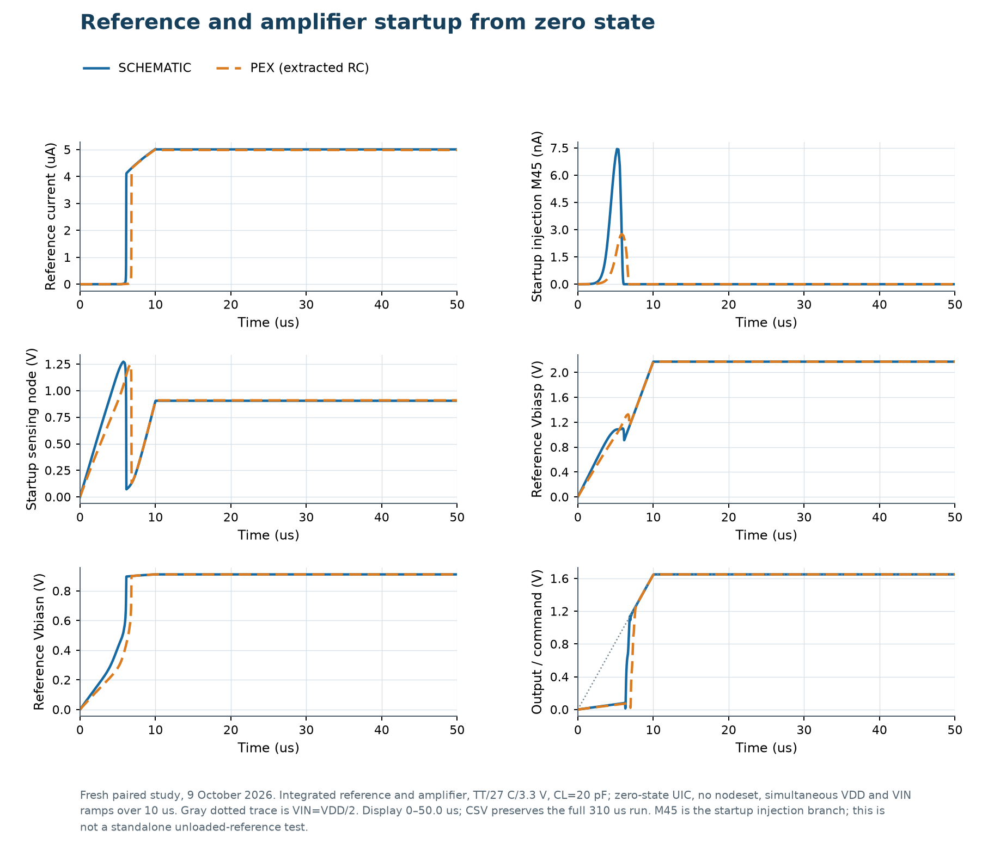
Figure 4. Nominal TT zero-state UIC startup of the complete amplifier with a 10 µs supply/input ramp. Schematic and post-layout results are overlaid; no forced bias initial condition is used. The input command follows half the ramped supply. Other tested ramps and the SS-cold case are summarized in the table.

The reference output terminates at diode-connected MBN. Its gate is shared with independent NMOS copies MNMASTER, MNPTAIL and MNPCAS. MNMASTER drives diode-connected MPMASTER, whose gate drives the independent PMOS copies MPNTAIL and MPNCAS. Current-consuming branches receive their own mirror devices; the original IREF wire does not directly feed several consumers.

Figure 5. Source-derived bias schematic. Independent copies create the PMOS and NMOS tail/cascode gate biases. Multiple gates may share a bias voltage; they add capacitance but negligible DC gate current in the model.

| Bias node | Generation and use |
| --- | --- |
| bias1 | PMOS MPTAIL diode, sunk by MNPTAIL; gates of M13/M23. |
| bias4 | NMOS MNTAIL diode, fed by MPNTAIL; gates of M22/M31. |
| bias2 | RPCAS plus PMOS MPCAS diode, sunk by MNPCAS; gates of M24/M16. |
| bias3 | NMOS MNCAS diode plus RNCAS, fed by MPNCAS; gates of M18/M19. |
| bias | Equal RCM_TOP/RCM_BOTTOM divider; spillover gates M2/M4/M7/M8. |

RPCAS and RNCAS are each 100 µm long, approximately 46.91 kΩ by the nominal generator value. Their roughly 0.235 V drop at 5 µA shifts the replica source voltage to provide cascode headroom. The midpoint divider uses two 150 µm high-poly resistors, approximately 70.09 kΩ each by the generator value. Its archived modeled current is 22.215 µA. It contributes directly to the supply budget and is separate from IREF.

| Final full-RC nominal bias | Voltage or current |
| --- | --- |
| bias1 / bias4 | 2.053540 / 1.046924 V |
| bias2 / bias3 | 2.046170 / 1.139126 V |
| Midpoint bias at spillover gates | 1.650283 V |
| NMOS / PMOS master gates | 0.912340 / 2.161656 V |
| Class-AB replica net8 / net9 | 1.938737 / 0.951872 V |
| PMOS / NMOS input tail current | 5.2455 / 5.7343 µA |
| Floating-copy total current | 4.7180 µA |
| Output PMOS / NMOS current at OUT | 161.8829 / 161.8829 µA |

The two output idle currents describe the same approximately 162 µA path through the complementary pair. Adding them would double-count the supply draw. Nominal 1:1 copies also differ slightly from IREF because their source/drain/body conditions differ. The table uses local terminal voltages and DC terminal currents, including leakage, recovered from the saved full-RC point.

The reference is visibly supply- and temperature-dependent. The tables contain three discrete TT points per study, all with 20 pF and no DC load. The supply study holds temperature at 27 °C and commands VAPWR/2, so it also changes the input common-mode operating point. The temperature study holds VAPWR at 3.3 V and the command at 1.65 V. VDPWR remains 1.8 V throughout.

| Condition | Schematic IREF (µA) | Post-layout IREF (µA) | Schematic supply (µA) | Post-layout supply (µA) |
| --- | --- | --- | --- | --- |
| 3.0 V | 4.8228 | 4.8013 | 238.968 | 238.019 |
| 3.3 V | 5.0085 | 4.9857 | 261.425 | 260.332 |
| 3.6 V | 5.1848 | 5.1607 | 283.345 | 282.114 |

| Condition | Schematic IREF (µA) | Post-layout IREF (µA) | Schematic supply (µA) | Post-layout supply (µA) |
| --- | --- | --- | --- | --- |
| −40 °C | 3.9365 | 3.9187 | 207.634 | 206.780 |
| 27 °C | 5.0085 | 4.9857 | 261.425 | 260.332 |
| 125 °C | 6.5270 | 6.4974 | 339.775 | 338.372 |

Relative to TT/27 °C/3.3 V, changing VAPWR from 3.0 to 3.6 V moves IREF by -3.71% to +3.52% in the schematic and -3.70% to +3.51% after layout. Post-layout supply current changes by -8.57% to +8.37%. Changing temperature from −40 to 125 °C moves IREF by -21.40% to +30.32% in the schematic and -21.40% to +30.32% after layout; post-layout supply current changes by -20.57% to +29.98%. These are finite changes from the nominal point, not fitted temperature coefficients. The generated bias voltages in Figures 6 and 7 move with the device thresholds, resistor values and required mirror compliance; approximately 5 µA is the nominal design point, rather than a precision current specification.

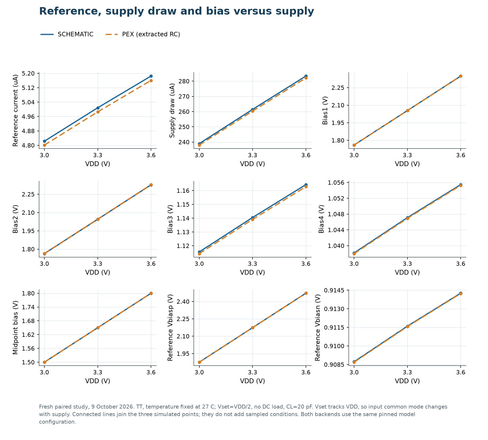
Figure 6. Supply dependence at TT and 27 °C. Only VAPWR changes between 3.0, 3.3 and 3.6 V. The follower command is VAPWR/2; load is 20 pF with no DC demand. Lines connect the three simulated points.

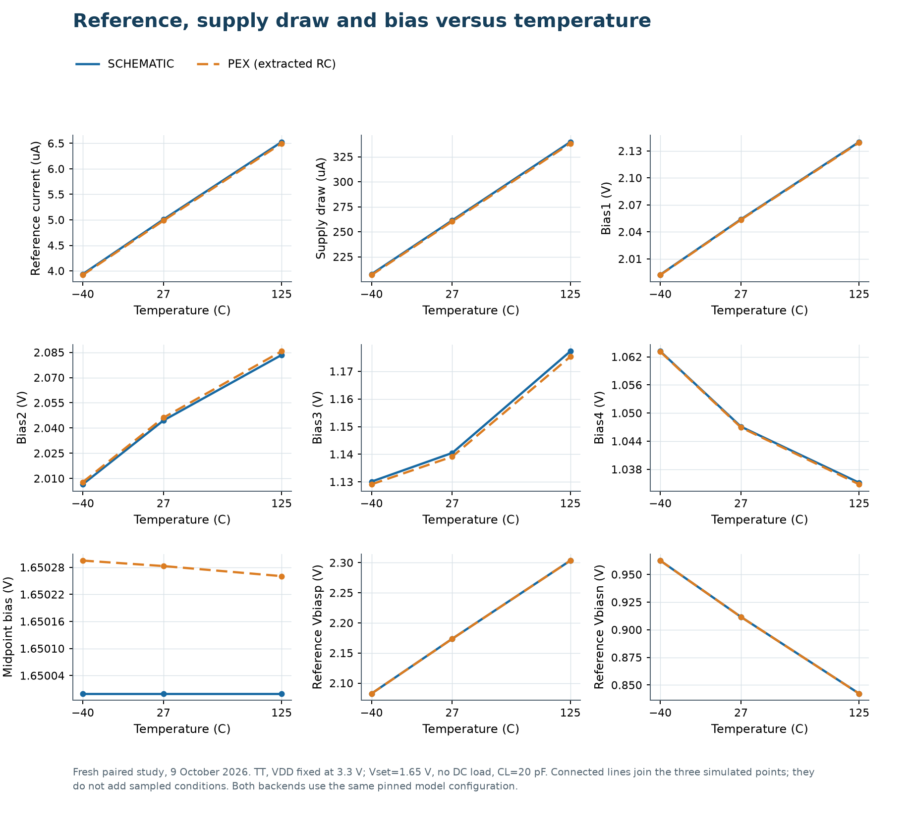
Figure 7. Temperature dependence at TT and fixed 3.3 V. Points at -40, 27 and 125 °C compare IREF, total supply current and the generated bias voltages. The input/output operating point is 1.65 V with 20 pF and no DC demand.

Temperature changes MOS mobility and threshold voltage, body effect and high-poly resistance. Their effects compete, so a monotonic current or a zero temperature coefficient cannot be assumed from the beta-multiplier formula. Supply dependence also reflects finite mirror output resistance and compliance. The isolated sweeps above distinguish these effects from the combined process/temperature/supply regression.

## 5. DC regulation, common-mode range and output drive

A follower sweep tests whether OUT follows IN+, but it changes input common-mode and output voltage together. This report therefore uses both a follower transfer sweep and a separate common-mode sweep with OUT held near mid-supply by an ideal test-only level shift in the feedback path. That level shift is not part of the amplifier.

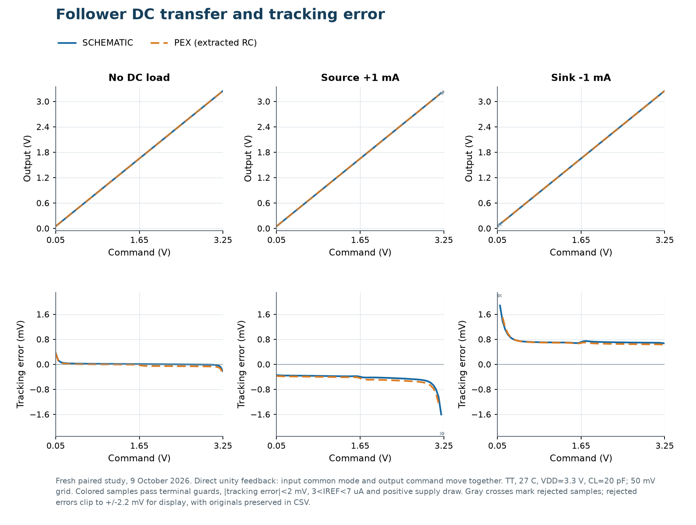
Figure 8. Core follower transfer and signed regulation error at TT, 27 °C, 3.3 V and 20 pF, with no DC load and ±1 mA current demand. Positive load demand means the amplifier sources current from OUT; negative demand means it sinks current into OUT.

The following intervals are the contiguous valid sampled commands around 1.65 V. A point is accepted only when the DC device-terminal guard passes, |OUT−command| is below 2 mV, IREF is between 3 and 7 µA and the analog supply delivers positive current.

| Test | DC load | Schematic valid command (V) | Post-layout valid command (V) |
| --- | --- | --- | --- |
| Follower | 0 | 0.05–3.25 | 0.05–3.25 |
| Follower | +1 mA source | 0.05–3.20 | 0.05–3.15 |
| Follower | −1 mA sink | 0.10–3.25 | 0.15–3.25 |
| Fixed input common mode | 0 | 0.05–3.25 | 0.05–3.25 |
| Fixed input common mode | +1 mA source | 0.05–3.20 | 0.05–3.20 |
| Fixed input common mode | −1 mA sink | 0.10–3.25 | 0.15–3.25 |

For the fixed-input-common-mode output sweep, IN+ is fixed at 1.65 V and a test-only feedback level shift requests each output command. The differential correction is small inside the valid interval, so the input pair's mean remains close to 1.65 V. The values are sampled boundaries on a 50 mV grid, rather than continuously located failure thresholds. A 0.05 V low boundary or 3.25 V high boundary reaches the scan limit; it does not qualify the exact rail. Points outside an interval are not qualified by that test.

Figure 8b. Output-range sweep with input common mode held near 1.65 V by a test-only feedback level shift: TT, 27 °C, 3.3 V, 20 pF, with no DC load and ±1 mA. This separates output-stage headroom from the moving input common mode of the follower sweep. All DC sweeps sample commands from 0.05 to 3.25 V on a 50 mV grid; the exact rails are not sampled.

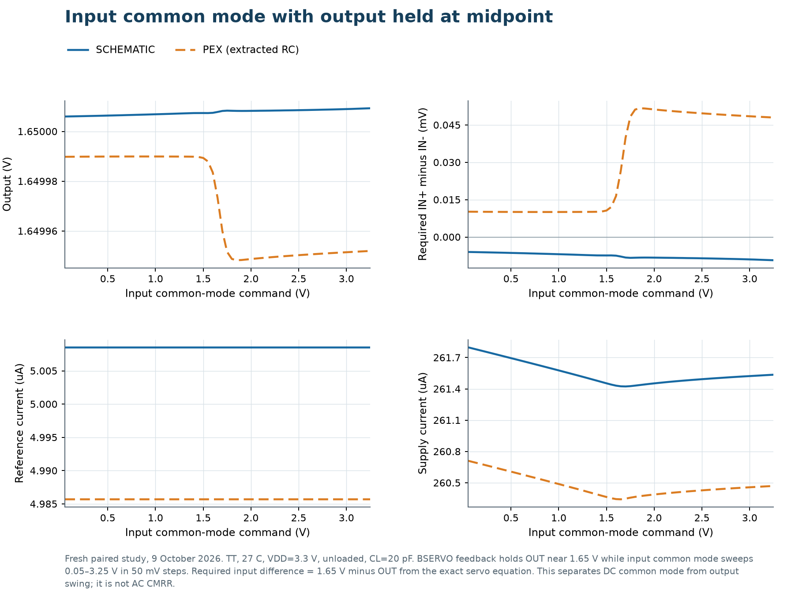
Figure 9. Input common-mode sweep at TT, 27 °C and 3.3 V, with nominal OUT held at 1.65 V and 20 pF, no DC load. The differential input required to maintain feedback and the supply current reveal crossover behaviour separately from output swing.

The feedback source is defined by IN−−OUT = IN+−1.65 V. Consequently the signed differential required by the amplifier is IN+−IN− = 1.65 V−OUT, the negative of the saved OUT−1.65 V servo error. This relation recovers the differential from the saved output trace without claiming an independently saved input-difference signal. The swept command is IN+; the actual input mean is IN+ minus half this differential.

| Representation | Valid IN+ command (V) | Required signed differential over interval (µV) | Supply current over interval (µA) |
| --- | --- | --- | --- |
| Schematic | 0.05–3.25 | -9.31 to -5.99 | 261.42–261.80 |
| Post-layout | 0.05–3.25 | +10.06 to +51.73 | 260.34–260.71 |

OUT is held within 2 mV of 1.65 V at accepted points, with the same current and physical criteria used by the DC sweeps. Thus the test separates input common-mode behaviour from output-stage rail headroom. Supply-current and differential changes through the crossover are simulated operating-point effects; this is not a mismatch-derived input-offset distribution or a CMRR measurement.

Sourcing requires the PMOS output device to retain useful voltage across it; sinking requires the NMOS device to do the same. Close to a rail, feedback cannot create unlimited gate drive or remove the finite on-resistance of the output stage. This explains why current capability and output swing must be specified together. The present checked DC envelope is ±1 mA at the stated conditions, rather than a measured absolute maximum drive current.

The external analog path matters under load. A 500 Ω output-path resistance drops 0.5 V at 1 mA. The Tiny Tapeout interface's 4 mA limit is an interface constraint, not a specification that this amplifier delivers 4 mA with acceptable distortion or regulation. The core curves above exclude the external switch path; external-feedback stability results appear in the next chapter.

## 6. Frequency response and feedback stability

The loop response is obtained with two AC injection experiments at the unity-feedback connection. The Tian return ratio preserves loading on both sides of the injection point. Phase margin is measured at the downward unity-magnitude crossing; gain margin is measured at the relevant -180° phase crossing. A closed-loop response is also recorded, since peaking is directly relevant to follower operation.

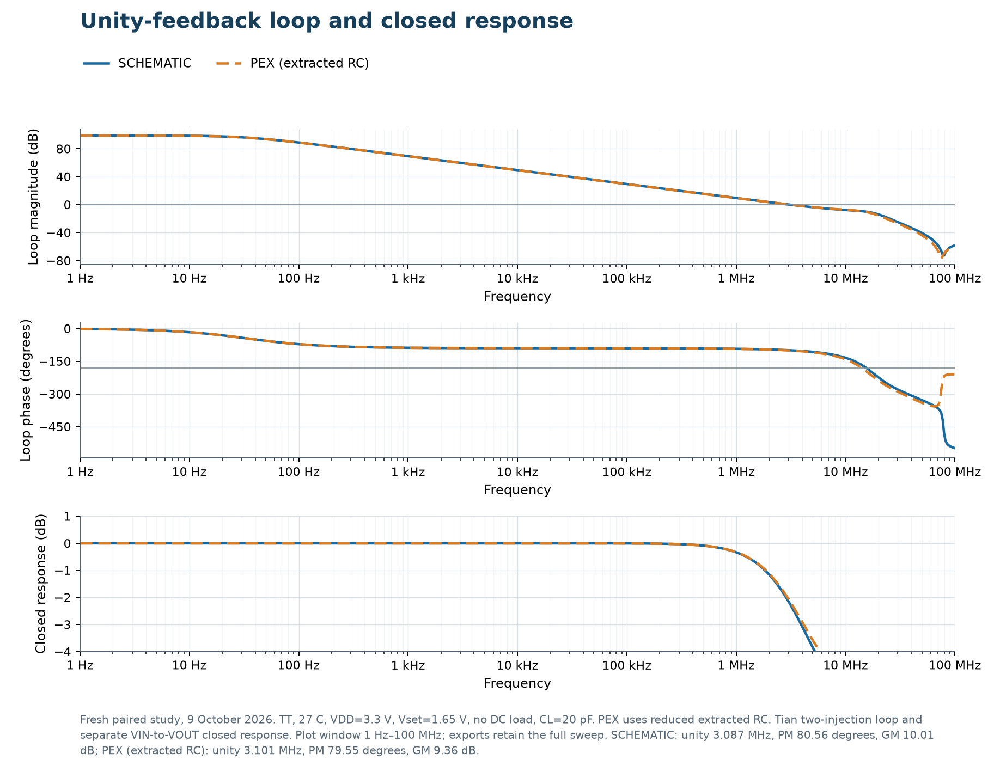
Figure 10. Paired nominal return-ratio magnitude/phase and closed-loop response: TT, 27 °C, 3.3 V, 1.65 V follower command, 20 pF, no DC load. The schematic and final-layout curves share models and testbench settings.

| Representation | Return ratio at 1 Hz (dB) | Downward unity crossing (MHz) | Phase margin (°) | Gain margin (dB) | Maximum closed gain (dB) |
| --- | --- | --- | --- | --- | --- |
| Schematic | 98.946 | 3.0872 | 80.557 | 10.011 | -0.0000 |
| Post-layout | 98.878 | 3.1007 | 79.555 | 9.364 | -0.0024 |

At nominal conditions layout changes the phase margin by -1.003° and the gain margin by -0.647 dB. The maximum closed-loop gain remains below 0 dB on the recorded frequency grid, so there is no gain above unity in this nominal follower response.

For reproducibility, VJ is the voltage source from IN− to OUT and IT injects current from ground into OUT. The voltage experiment uses VJ AC=1 and IT AC=0; the current experiment uses VJ AC=0 and IT AC=1. I(VJ) is positive from IN− to OUT. Let vv and iv be V(OUT) and I(VJ) from the voltage experiment, and vi and ii the same observations from the current experiment. The implemented expression is k = 2(iv·vi − ii·vv) − ii − vv, followed by T = k/(1−k). With these source orientations T is positive at low frequency, the critical point is −1 and the closed-loop denominator is 1+T. The independent signal-transfer run sets IN+ AC=1 and both injection sources AC=0.

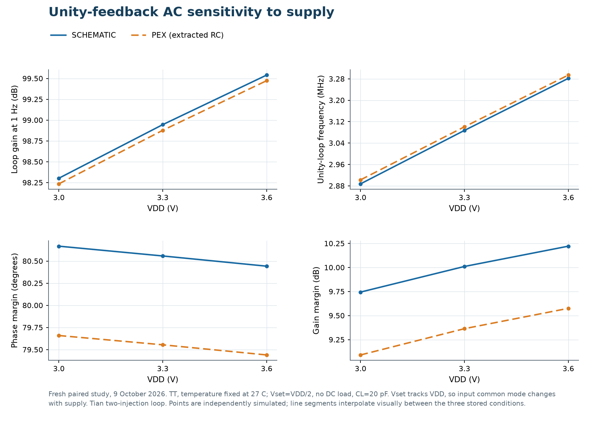
Figure 11. Paired response at TT, 27 °C and 3.0/3.3/3.6 V; command VAPWR/2, 20 pF, no DC load. This is an isolated supply study, not a process-corner sweep.

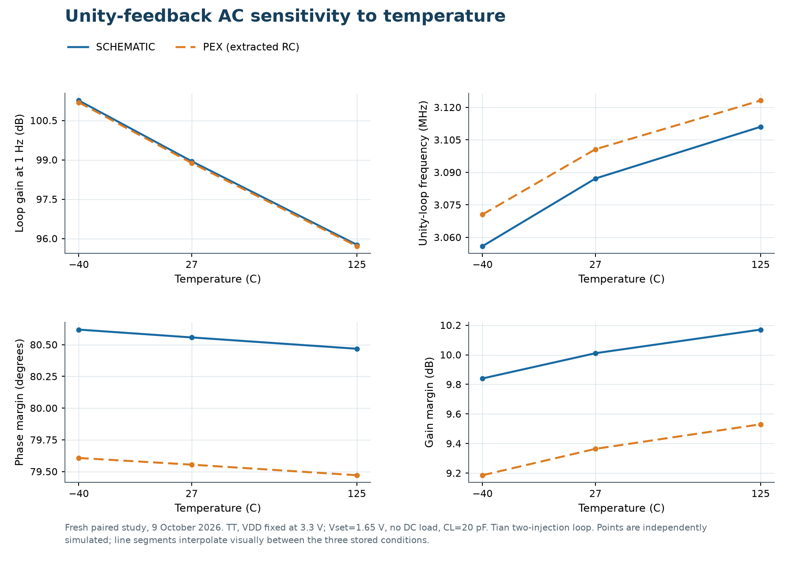
Figure 12. Paired response at TT, 3.3 V and -40/27/125 °C; command 1.65 V, 20 pF, no DC load. Identical loads make the influence of temperature visible.

| TT condition | Representation | Unity crossing (MHz) | Phase margin (°) | Gain margin (dB) |
| --- | --- | --- | --- | --- |
| 3.0 V / 27 °C | Schematic | 2.8874 | 80.668 | 9.745 |
| 3.0 V / 27 °C | Post-layout | 2.9023 | 79.659 | 9.091 |
| 3.3 V / 27 °C | Schematic | 3.0872 | 80.557 | 10.011 |
| 3.3 V / 27 °C | Post-layout | 3.1007 | 79.555 | 9.364 |
| 3.6 V / 27 °C | Schematic | 3.2818 | 80.442 | 10.222 |
| 3.6 V / 27 °C | Post-layout | 3.2941 | 79.440 | 9.575 |
| 3.3 V / −40 °C | Schematic | 3.0559 | 80.619 | 9.840 |
| 3.3 V / −40 °C | Post-layout | 3.0706 | 79.607 | 9.186 |
| 3.3 V / 125 °C | Schematic | 3.1110 | 80.468 | 10.170 |
| 3.3 V / 125 °C | Post-layout | 3.1232 | 79.471 | 9.530 |

Across these five isolated TT conditions, the post-layout minimum phase margin is 79.440° and the minimum gain margin is 9.091 dB. The supply study also moves the follower command with VAPWR/2; the temperature study leaves it fixed. These five cases do not replace the wider combined-process, supply, temperature and output/load regression.

The broader final-layout core regression contains six selected profiles: TT/27 °C/3.3 V, SS/-40 °C/3.0 V, SS/125 °C/3.0 V, FF/125 °C/3.6 V, SF/125 °C/3.0 V and FS/125 °C/3.0 V. Each has seven output/load points at 20 pF: midpoint unloaded and ±1 mA, low sinking and high sourcing at 1 mA with 0.3 V rail allowance, and unloaded commands 0.1 V from either rail. All 42 saved operating points pass the physical-terminal guard. Their maximum absolute follower error is 1.5833 mV.

Four previously limiting external-feedback cases were rerun with the final core. One interface represents 500 Ω plus 5 pF per analog path; the other uses the nominal tt_asw_3v3 switch model plus 50 Ω and 5 pF per path. Each has an external 20 pF output load. Their minimum phase margin is 60.917°, and maximum closed-loop peaking is 0.688 dB. This is useful margin, but the four cases do not constitute a complete board/package qualification.

Neither positive phase margin at one load nor a good nominal step response establishes stability for every capacitance or output condition. The principal final checks use 20 pF. Cable and probe capacitance must be included when comparing bench measurements with these simulations.

## 7. Signal steps and load disturbances

Small-signal frequency response describes operation around an established bias point. A signal step also reveals settling and overshoot; a sudden current demand reveals how quickly the output stage and feedback restore regulation. These are different disturbances and are plotted separately.

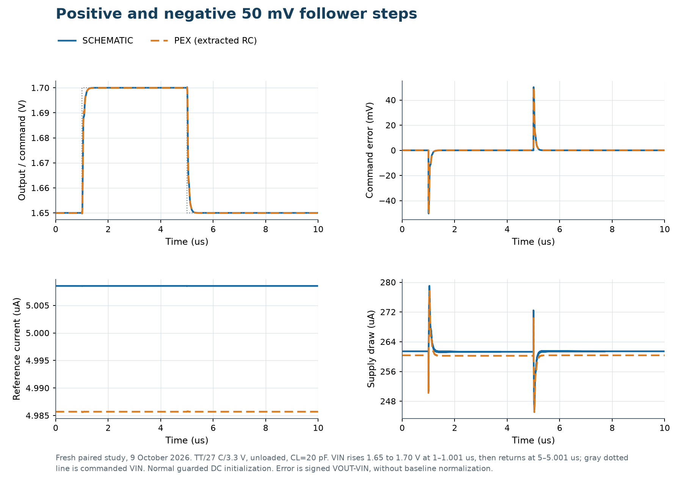
Figure 13. Follower commands 1.65 to 1.70 to 1.65 V: TT, 27 °C, 3.3 V, no DC load, 20 pF. Both backends use the same 1 ns input edges. The error panel shows signed OUT minus the instantaneous input command.

The command rises from 1.65 to 1.70 V and then returns to 1.65 V. The second transition is the 50 mV falling return.

| Representation | Input transition | Settling to ±0.5 mV command band (µs) | Final absolute command error (mV) |
| --- | --- | --- | --- |
| Schematic | +50 mV | 0.244 | 0.0076 |
| Schematic | −50 mV | 0.232 | 0.0078 |
| Post-layout | +50 mV | 0.257 | 0.0405 |
| Post-layout | −50 mV | 0.231 | 0.0266 |

Settling is measured from the end of the 1 ns input edge until OUT enters and remains inside an absolute ±0.5 mV band around the requested output for the rest of that plateau. The band equals 1% of a 50 mV step numerically, but it is centered on the commanded voltage rather than the measured final increment. It therefore includes the DC regulation error and differs from an incremental 1% settling metric. The plotted initial tracking error includes the input edge while the output is still responding; it should not be interpreted as 50 mV overshoot. These tests do not measure full-range large-signal slew rate.

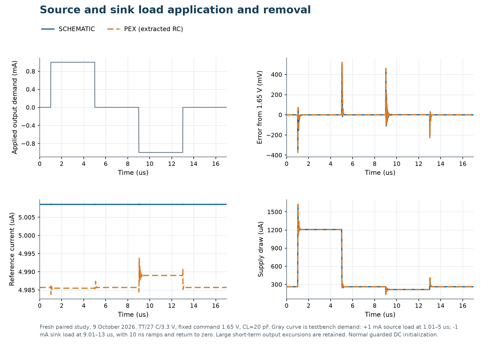
Figure 14. Applying and removing +1 mA and -1 mA core load demand with 10 ns edges, at a fixed 1.65 V follower command, TT, 27 °C, 3.3 V and 20 pF. The final output errors are separate from the peak transient excursions.

| Representation | Applied demand | Peak absolute error (mV) | Settling to ±2 mV command band (µs) | Final absolute error (mV) |
| --- | --- | --- | --- | --- |
| Schematic | +1 mA source | 347.22 | 0.318 | 0.397 |
| Schematic | −1 mA sink | 433.13 | 0.459 | 0.710 |
| Post-layout | +1 mA source | 373.60 | 0.301 | 0.444 |
| Post-layout | −1 mA sink | 461.52 | 0.421 | 0.682 |

The table measures the two load applications, starting at the end of each 10 ns edge and ending before its removal. Settling requires OUT to enter and remain within ±2 mV of the fixed 1.65 V command throughout that application interval. Load removals are visible in Figure 14 but are not assigned the application metrics above. The final plateau errors are below 1 mV even though the fast-edge excursions reach several hundred millivolts.

The archived final-RC tests give approximately 374 mV and 462 mV peak excursions when applying sourcing and sinking demands, respectively. A settled 1 mA DC load capability therefore does not imply a stiff output during a fast current edge. The class-AB output must change its gate drive while charging or discharging the output capacitance. For an application sensitive to those excursions, load slew, capacitance and external buffering would need to be characterized together.

The archived SS-cold ±1 mA signal tests use a positive 100 µV increment. They settle within 1% in about 0.304 µs, with less than 0.5% overshoot in those cases. Such tiny loaded steps test local feedback behaviour; they do not establish large-signal slew rate or settling for a full output-range transition.

## 8. Response to supply disturbances

Supply sensitivity has two meanings. The slow DC sweeps show how the operating point moves when the supply changes. A small AC perturbation or a supply step shows how much of a disturbance reaches OUT while the input command remains fixed. For these disturbance tests IN+ is fixed at 1.65 V and does not track VAPWR/2; otherwise the input would deliberately request output motion.

Figure 15. VAPWR coupling, closed-loop rejection and input-referred rejection at TT, 27 °C and 3.3 V, fixed 1.65 V command, 20 pF, no DC load. Closed rejection is -20 log10(abs(Hsupply)); input-referred rejection is 20 log10(abs(Hsignal/Hsupply)), using separately measured signal and supply transfers. The test covers the positive analog rail under the stated follower boundary conditions.

| Frequency | Schematic closed rejection (dB) | Post-layout closed rejection (dB) | Schematic input-referred rejection (dB) | Post-layout input-referred rejection (dB) |
| --- | --- | --- | --- | --- |
| 10 Hz | 104.94 | 77.70 | 104.94 | 77.69 |
| 1 kHz | 81.12 | 75.71 | 81.12 | 75.70 |
| 100 kHz | 41.14 | 40.06 | 41.14 | 40.05 |

At 10 Hz the post-layout closed-loop supply rejection is 27.25 dB lower than the schematic value. This is a material loss in positive-rail rejection despite the small changes in nominal gain and phase margin. Closed and input-referred values remain similar at low frequency because the follower signal transfer is close to unity; their distinction matters as that transfer rolls off. The measurements use AC=1 on VAPWR, AC=0 on IN+, fixed 1.8 V VDPWR and the same 20 pF load.

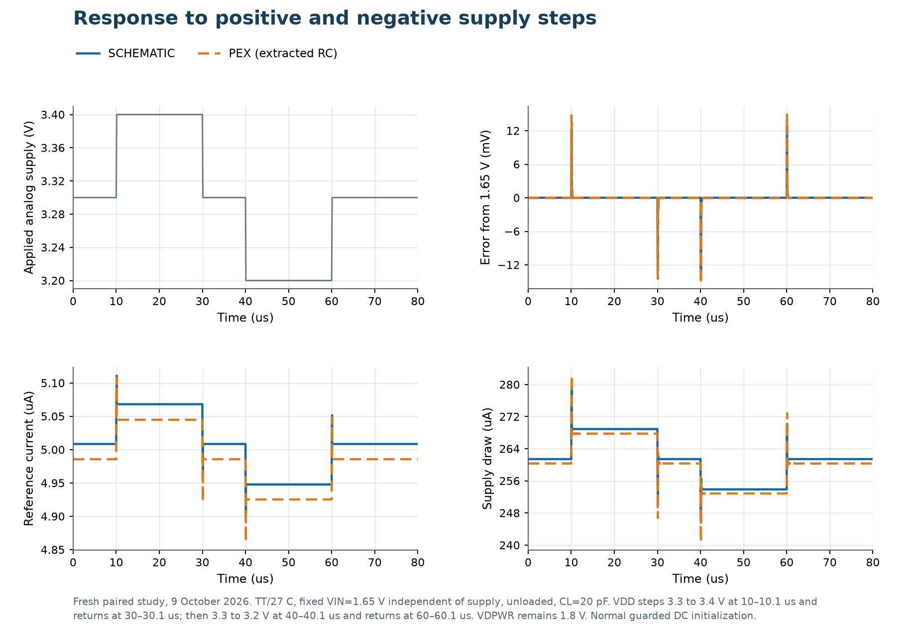
Figure 16. ±0.1 V supply steps about 3.3 V, with the command held at 1.65 V, TT, 27 °C, 20 pF and no DC load. The output-error and IREF traces distinguish signal disturbance from reference-current motion.

| Representation | Supply transition | Peak absolute OUT error (mV) | Settling to ±2 mV command band (µs) | Final absolute error (mV) |
| --- | --- | --- | --- | --- |
| Schematic | +0.1 V | 12.14 | 0.045 | 0.0084 |
| Schematic | −0.1 V | 13.23 | 0.095 | 0.0072 |
| Post-layout | +0.1 V | 13.47 | 0.045 | 0.0163 |
| Post-layout | −0.1 V | 14.79 | 0.105 | 0.0398 |

The signed pre-step OUT−1.65 V errors are +0.007833 mV for the schematic and -0.026618 mV after layout. The supply edges last 100 ns. The table measures the +0.1 V and −0.1 V applications after each edge completes, before the return to 3.3 V. Settling uses an absolute ±2 mV band around the fixed 1.65 V command. It is not a 1% incremental supply-step metric.

The late supply-step plateaus provide a separate signed DC check with the input fixed. Averaging OUT over 25–29 µs at 3.4 V and 55–59 µs at 3.2 V gives [OUT(3.4 V)−OUT(3.2 V)]/0.2 V = +6.374 µV/V for the schematic and +117.181 µV/V after layout. The corresponding 1 Hz small-signal supply-transfer real parts are +5.592 and +130.376 µV/V. Both checks agree on the positive coupling sign and much larger layout sensitivity. The finite ±100 mV secants differ from the small-signal derivatives by +14.0% and -10.1% respectively; they corroborate the trend without establishing equality for a nonlinear finite disturbance.

At low frequency, feedback can suppress supply-driven output error. At higher frequency, reduced loop gain and capacitive coupling weaken that suppression. The self-biased reference and the midpoint divider also respond to the supply. These plots describe the stated core boundary conditions; the board regulator, decoupling, package and shuttle supply distribution add further paths not included in this test.

## 9. Scope, evidence and reproduction

The new paired tests were run on 9 October 2026 with ngspice 44 and SKY130 PDK release bdc9412b3e468c102d01b7cf6337be06ec6e9c9a. The MOS process and local mismatch switches are disabled for these deterministic comparisons; passive components use the same typical R/C models on both sides. The isolated supply and temperature studies use TT. The earlier 42-case final-layout regression is retained as a separate combined-PVT qualification.

The final GDS has SHA256 51fc3c35decbf8409eec6f5720971efe651120b82ab5025a5dba9840b7bcdddc. The report does not change the schematic, layout, interface metadata or submission exports. The final extracted network comes from the 8 October hierarchy. Its reduced resistance representation retains the functional devices and extracted capacitances; the archived nominal comparison against the full network has maximum relative complex loop difference 3.70 x 10^-8.

| Fresh paired stage | Passing cases | Expected cases |
| --- | --- | --- |
| Operating | 10 | 10 |
| Dc | 14 | 14 |
| Startup | 8 | 8 |
| Transient | 4 | 4 |
| Supply | 2 | 2 |

All 38 fresh cases completed with passing stage status. The report-data manifest independently rechecked SHA256 for 518 saved case files and the shared source, extracted-network, model-library, observation-map, driver and simulator inputs. DC/AC guards inspect all 49 schematic or 225 extracted MOS instances at each saved operating point; the DC sweep guard additionally checks every swept point. The guard checks terminal-voltage plausibility and the stated HV stress limits, not whether every MOS remains in saturation. Dynamic runs cross-check their final state against a separately guarded DC endpoint; the saved transient channels do not prove every-device transient stress.

A separate Windows ngspice 44 smoke comparison against the archived Linux nominal reduced network matched all 721 frequency samples. Its maximum relative complex return-ratio difference was 8.87e-09, and the maximum relative closed-signal-transfer difference was 1.01e-10, both below the 1e-06 comparison tolerance. That cross-platform check applies to the smoke deck; it does not imply bit-for-bit identity of every fresh test or validation of all full-network operating points. The original final full/reduced nominal loop comparison remains the evidence for that reduction at nominal conditions.

Simulation decks, model provenance, case conditions, metrics and the data underlying the plots are retained with the characterization results. DC convergence is checked against actual device-terminal voltages, rather than accepting a numerical solution solely because the solver returned a value. Nodesets in DC/AC are initial guesses; startup simulations use zero-state UIC and no forced bias. Frequency sweeps use 80 points per decade from 1 Hz to 1 GHz.

The remaining boundaries are silicon measurement, noise, full positive-and-negative-supply PSRR and CMRR characterization, comprehensive local mismatch/yield analysis, arbitrary board parasitics and 100 pF load qualification. The earlier exploratory mismatch study is not used to promise a production offset distribution. These limits define where additional evidence is needed.

The physical interface follows the [Tiny Tapeout analog specifications](https://tinytapeout.com/specs/analog/). Device models are from the [pinned SKY130 release](https://github.com/chipfoundry/volare/releases/tag/sky130-bdc9412b3e468c102d01b7cf6337be06ec6e9c9a). The simulation engine is [ngspice 44](https://sourceforge.net/projects/ngspice/files/ng-spice-rework/old-releases/44/). The circuit reference is Johan H. Huijsing, *Operational Amplifiers*, Fig. 7.7.6, the compact 2 V rail-to-rail input/output class-AB GA-CF-GA arrangement with Miller compensation; this project uses its own 3.3 V SKY130 dimensions and bias implementation.

# How to test

The design interface is ua[0]=IN+, ua[1]=IN-, ua[2]=OUT. VAPWR supplies the 3.3 V analog circuit, VDPWR is the separate 1.8 V shuttle supply, and VGND is common ground. Digital inputs are unused; digital outputs and bidirectional output enables are tied to ground. ena does not turn off the internal reference. Project selection connects the external analog paths through the shuttle switches. Consult the board mapping for actual connector locations.

1. Select the project, apply the two supplies with common ground and provide local decoupling. Begin with no DC output load and a low-capacitance instrument.
2. Connect external OUT to IN- to make a follower. Apply 1.65 V to IN+. A 1 ms initial measurement delay is convenient; it is not a simulated startup-time specification.
3. Confirm output regulation and plausible analog supply current. A board supply reading may include circuitry beyond the roughly 260 µA core.
4. Sweep the command slowly from 0.8 to 2.5 V, recording output error and supply current. Then add controlled source and sink demands gradually toward 1 mA.
5. Measure a 50 mV step near mid-supply and a small-signal sine sweep. Record the actual stimulus, load, probe capacitance and feedback path with each result.
6. Compare temperature and supply changes separately. For supply-rejection testing, hold the input command independent of the disturbed supply.

An open-loop output often saturates because even a small input difference is amplified strongly. Begin in closed loop. Keep feedback short and account for probe/cable capacitance. A resistor load varies with output voltage; use a controlled current load when trying to reproduce the constant-current simulation cases. Separate the input common-mode test from output swing by holding the output near mid-supply in a suitable closed-loop configuration.

# External hardware

Use an analog-capable Tiny Tapeout board, regulated 1.8 V and 3.3 V supplies, local decoupling, a DC/signal source, a voltmeter and a low-capacitance oscilloscope probe. Controlled loads and a frequency-response instrument extend the characterization. No external reference, bias source or clock is required.
