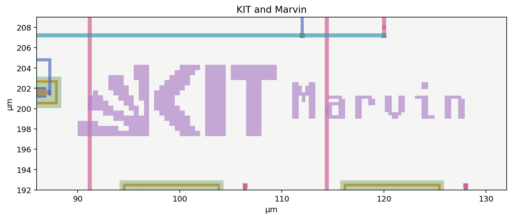

# Routing cleanup verification

8 October 2026. SKY130 3.3 V rail-to-rail OpAmp; existing transistor sizing and placement retained.

Shortened 24 gate-access connections, removing 46.4 µm of Metal1 and 24.0 µm of unused Metal2 tails. Four Metal2 spans were shifted by 0.8 µm to avoid long overlap with other gate nets. The detours add 6.4 µm of total path length, or 5.6 µm when shared segments are counted once. The selected overlap spans originally totalled 30.23 µm; 0.36 µm of short crossing overlap remains.

Removed the train artwork. KIT and Marvin are aligned beside one another in the free space, with no device overlap or connection to functional Metal4. Device primitive geometry, sizing, placement, functional Metal4 and all 54 top-pin positions match the previous layout.

Short crossings and shared supply buses remain. The longer overlap beside the XM39 startup gate was retained because the adjacent tracks are occupied; moving it would require a larger change. The shorter overlaps beside XM23 and XRNCAS, and the wide XM32 output collection buses crossing Metal1 gate buses, remain in this revision. The output buses retain their full width and contact arrays for current delivery.

| Physical check | Result |
|---|---|
| Native layout / GDS readback full DRC | 0 / 0 errors |
| Top schematic, GDS readback and gate-level/GDS LVS | Circuits match uniquely |
| Antenna check | 0 feedback entries |
| Local official Tiny Tapeout precheck | 15 / 15 pass |
| LEF pins / reserved Metal5 | 54 / absent |

Fresh resistor/capacitor extraction was checked against the current layout-cell hashes and LVS reference. The wire-resistance-collapsed check matched uniquely. Exact reductions preserve functional devices and account for isolated artwork capacitance; original extraction files remain available.

Full versus reduced TT complex-loop response differs by at most **3.7e-08 relative**. Every extracted core/interface operating point passed the 225-MOS physical-terminal guard.

| Nominal TT, 27 °C, 3.3 V, 20 pF, no DC load | Simulated |
|---|---:|
| Output at 1.65 V command | 1.649973 V |
| Supply current | 260.342 µA |
| Reference current | 4.985695 µA |
| Low-frequency loop gain | 98.878 dB |
| Unity-loop frequency | 3.1007 MHz |
| Phase margin / gain margin | 79.555° / 9.364 dB |

The 42-case core sweep covers TT (27 °C, 3.3 V), SS (−40/125 °C, 3.0 V), FF (125 °C, 3.6 V), and SF/FS (125 °C, 3.0 V). Each profile includes mid-supply unloaded/source/sink cases, low-output sinking, high-output sourcing, and unloaded near-rail cases; source/sink demand is ±1 mA. Six identical cases already checked in the targeted run were reused only after extraction provenance and all eight case-artifact hashes matched.

Minimum core phase margin: **71.525°** (`ss_cold_low_0_reduced`). Minimum gain margin: **6.428 dB** (`ss_cold_mid_source_reduced`). Maximum follower DC error: **1.5833 mV** (`ff_hot_low_sink_reduced`).

The four previously weakest external-interface cases were rerun with the fresh extracted core. The interface includes either the 3.3 V analog-switch model plus 50 Ω per path, or 500 Ω per path, with an additional 5 pF per path and 20 pF external load.

| Interface case | PM (°) | GM (dB) | DC error (mV) |
|---|---:|---:|---:|
| `r500_ss_hot_mid_0` | 60.917 | 11.547 | 0.0100 |
| `r500_ss_cold_mid_0` | 60.951 | 10.954 | 0.0238 |
| `asw_ss_cold_mid_sink` | 65.602 | 7.510 | 0.5048 |
| `asw_ss_cold_high_source` | 87.502 | 6.872 | 0.3803 |

Startup uses zero-state UIC, a 10 µs supply ramp and no nodesets or initial-condition forces. Both TT and SS-cold settled to the intended follower operating point.

| Startup | Settled error (mV) | IREF range (µA) |
|---|---:|---:|
| `startup_tt_10us` | 0.02662 | 4.985695–4.985695 |
| `startup_ss_cold_10us` | 0.02384 | 3.899327–3.899327 |

| Follower step | 1% settling (µs) | Overshoot (%) |
|---|---:|---:|
| `tt_unloaded_50mV` | 0.2512 | 0.000 |
| `ss_sink_100uV` | 0.3045 | 0.497 |
| `ss_source_100uV` | 0.3045 | 0.003 |

| ±1 mA load step | Maximum excursion (mV) | Settled error (mV) |
|---|---:|---:|
| `tt_loadstep_source` | 373.595 | 0.44372 |
| `tt_loadstep_sink` | 461.517 | 0.68224 |

**Scope:** 20 pF external load is covered by these checks. A 100 pF load remains unqualified.

Logs, physical operating-point dumps, loop data, startup/step waveforms, original RC products and provenance remain in the evidence bundle.

GDS SHA256: `51fc3c35decbf8409eec6f5720971efe651120b82ab5025a5dba9840b7bcdddc`
