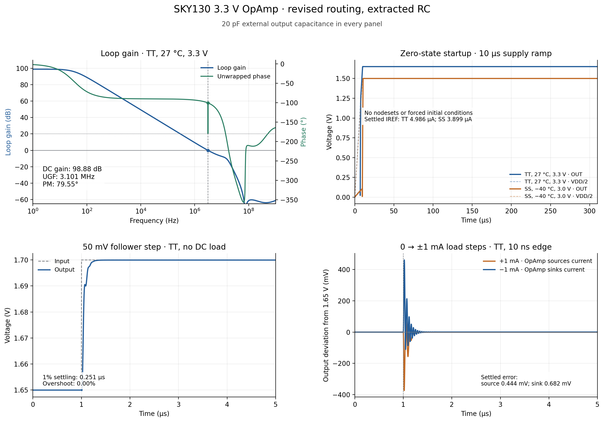

# Verification

This report describes the 8 October 2026 verification of the final routed 3.3 V layout. All performance values are simulated. The corresponding GDS is identified by SHA256:

```text
51fc3c35decbf8409eec6f5720971efe651120b82ab5025a5dba9840b7bcdddc
```

The repository cleanup after verification retained the circuit, device cells, GDS and LEF. This documentation update also leaves them unchanged. Earlier schematic studies are identified separately below.

## Physical checks and extraction

| Check | Result |
| --- | --- |
| Native hierarchical layout full DRC | 0 errors |
| Exported GDS readback full DRC | 0 errors |
| Top-level schematic/layout LVS | Circuits match uniquely |
| GDS readback / schematic LVS | Circuits match uniquely |
| Gate-level wrapper / GDS LVS | Circuits match uniquely |
| Antenna check | 0 feedback entries |
| Official Tiny Tapeout precheck | 15 of 15 pass |
| LEF interface | 54 template pins |
| Reserved Metal5 | Absent |

Fresh RC extraction was checked against layout-cell fingerprints and the LVS reference. Collapsing only the extracted wire resistance gave a unique LVS match. Before merging, the functional extraction contains 225 MOS devices, five resistors and three MIM capacitors. The MOS count includes physical finger expansion; it is not the number of named schematic MOS groups.

The raw network contains **21,799 positive wire resistances and 1,915 parasitic capacitors**. An exact resistor-network reduction and elimination of floating artwork nodes preserve the functional circuit; the reduced network retains 1,876 parasitic capacitors. This treatment accounts for capacitive coupling through isolated artwork rather than simply deleting it.

At the nominal TT operating point, full and reduced RC complex-loop responses differ by a maximum relative **3.7045×10⁻⁸**, below the 10⁻⁵ comparison criterion. Most sweeps use the reduced network to reduce run time. That comparison verifies reduction equivalence at the tested point; it does not qualify an approximate extraction of a different layout.

Each fresh core and interface DC operating point was checked at all 225 physical MOS devices. The terminal-voltage guards passed. These checks reject nonphysical solver roots; they do not by themselves prove that every device remains in saturation during every transient.

The local extraction used Magic 8.3 revision 473 and the SKY130A technology from open_pdks revision `bdc9412b3e468c102d01b7cf6337be06ec6e9c9a` (technology version `1.0.466-0-gbdc9412`). Netgen reports version 1.5.270. The nominal raw operating-point header identifies ngspice 44, and the run logs confirm use of KLU.

## Core DC and loop-gain regression

The final extracted-core suite comprises **six PVT profiles × seven operating points = 42 cases**, each with 20 pF at the output.

| Profile | Temperature (°C) | VAPWR (V) |
| --- | ---: | ---: |
| TT | 27 | 3.3 |
| SS cold | −40 | 3.0 |
| SS hot | 125 | 3.0 |
| FF hot | 125 | 3.6 |
| SF hot | 125 | 3.0 |
| FS hot | 125 | 3.0 |

SF and FS are the PDK corner names. The profile set checks selected adverse combinations; it is not a Cartesian sweep of every process, supply and temperature.

| Operating point | Follower command | DC load demand |
| --- | --- | --- |
| Midpoint, unloaded | VAPWR/2 | 0 |
| Midpoint, source | VAPWR/2 | Amplifier sources 1 mA |
| Midpoint, sink | VAPWR/2 | Amplifier sinks 1 mA |
| Low output, sink | 0.3 V | Amplifier sinks 1 mA |
| High output, source | VAPWR−0.3 V | Amplifier sources 1 mA |
| Near ground, unloaded | 0.1 V | 0 |
| Near supply, unloaded | VAPWR−0.1 V | 0 |

Six identical cases from the targeted run were reused after matching extraction provenance and all eight recorded case-artifact hashes. The other 36 cases were run for this qualification. The nominal full-RC comparison is separate from the 42 reduced-RC cases.

| Result over the 42 cases | Value | Limiting case |
| --- | ---: | --- |
| Minimum phase margin | 71.525° | SS cold, 0.1 V, unloaded |
| Minimum gain margin | 6.428 dB | SS cold, midpoint, source 1 mA |
| Maximum absolute follower DC error | 1.5833 mV | FF hot, 0.3 V, sink 1 mA |

The individual numeric results are in [core-cases.csv](data/core-cases.csv). Positive `load_demand_mA` means that the amplifier supplies current to the load; negative means that it sinks current.

### Loop measurement

The unity-feedback operating point is retained while two small-signal injections are applied at the loop break: a series voltage injection and a shunt current injection. The test combines the two responses to obtain the return ratio. This matters because output resistance, the feedback path and interface loading can invalidate a simple single-injection estimate.

For the recorded sign convention, `VJ` is oriented from the inverting input to the feedback/output node, and `IT` injects current from ground into that node. `I(VJ)` is positive toward the feedback node. With unit voltage excitation, record node voltage `vv` and source current `iv`; with unit current excitation, record `vi` and `ii`. The archived calculation is:

```text
k = 2*(iv*vi - ii*vv) - ii - vv
T = k/(1-k)
```

Responses are normalized by the unit excitation. This gives positive low-frequency return ratio and the critical stability point at −1. Phase margin is `180° + phase(T)` at downward unity crossings, using continuous unwrapped phase. Gain margin is `−20*log10(abs(T))` at the odd −180° crossings; the minimum relevant margin is reported. Core AC runs use 80 points/decade from 1 Hz to 1 GHz, and interface runs use 60 points/decade. Low-frequency gain is the 1 Hz value, not follower gain or an exact zero-frequency analytical gain.

The repository's [loop testbench](../xschem/testbench_loop_3v3.sch) implements this two-injection calculation. The [AC testbench](../xschem/testbench_ac_3v3.sch) is a separate open-loop gain diagnostic with DC feedback maintained by an ideal large inductor and AC separation by an ideal large capacitor. Those elements exist only in the testbench. Its default 5 pF load and the loop bench's default sinking load differ from the nominal 20 pF unloaded result; running the unmodified tabs therefore need not reproduce the nominal table.

## External analog interface

Two interface models were used around the amplifier core:

- A conservative 500 Ω series resistance and additional 5 pF capacitance per analog path.
- The nominal `tt_asw_3v3` analog-switch model, plus 50 Ω series resistance and additional 5 pF per path.

Both include 20 pF external output load and external unity feedback. The nominal switch model and the 500 Ω model are distinct. The added lumped elements represent additional path allowance, not a claim that every physical shuttle switch has those exact parameters.

Four cases previously identified as limiting were rerun with the fresh extracted core:

| Case | PM (°) | GM (dB) | Absolute follower error (mV) |
| --- | ---: | ---: | ---: |
| 500 Ω, SS hot, midpoint, unloaded | 60.917 | 11.547 | 0.0100 |
| 500 Ω, SS cold, midpoint, unloaded | 60.951 | 10.954 | 0.0238 |
| Switch model, SS cold, midpoint, sink 1 mA | 65.602 | 7.510 | 0.5048 |
| Switch model, SS cold, high output, source 1 mA | 87.502 | 6.872 | 0.3803 |

Maximum closed-loop peaking in these four cases is **0.688 dB**. The earlier full 60-case interface study was not repeated in its entirety after the last routing changes. The current evidence is the fresh four-case regression and the 42-case core sweep, not a fresh 60-case interface qualification. See [interface-cases.csv](data/interface-cases.csv).

At 1 mA, 500 Ω produces a 0.5 V path drop. Adding the tested loaded core headroom of about 0.3 V explains the conservative initial external follower range of 0.8–2.5 V at 3.3 V. This is an engineering allowance based on the tested points, not a measured continuous swing specification.

## Startup and transients

The final extracted-RC dynamic suite contains seven cases: two startups, three positive input steps and two load applications. All use 20 pF at the core output.

### Zero-state startup

Supply and follower command ramp together from zero to their nominal values over 10 µs. UIC starts from the zero state, with no nodeset or forced initial bias voltage. Runs extend to 310 µs; settled error and IREF bounds below are measured in the 260–310 µs window.

| Case | Supply (V) | Settled follower error (mV) | Settled IREF (µA) |
| --- | ---: | ---: | ---: |
| TT, 27 °C | 3.3 | 0.02662 | 4.985695 |
| SS, −40 °C | 3.0 | 0.02384 | 3.899327 |

Both runs leave the zero-current state and settle to the intended bias point. These results qualify the two stated ramps. They do not establish a worst-case startup time for arbitrary ramp speed, input sequencing, brownout or temperature.

### Input steps

| Case | Positive step | 1% settling (µs) | Overshoot (%) |
| --- | ---: | ---: | ---: |
| TT, no DC load | 50 mV | 0.2512 | 0.000 |
| SS cold, sink 1 mA | 100 µV | 0.3045 | 0.497 |
| SS cold, source 1 mA | 100 µV | 0.3045 | 0.003 |

The step begins at 1 µs with a 1 ns input ramp. Settling is measured from the end of that ramp. Initial and final levels are the average responses in 0.8–0.99 µs and 4.5–5 µs respectively. The 1% band is relative to this response change, so it measures incremental settling rather than absolute input-to-output accuracy. A small loaded step can settle accurately even when its absolute DC offset exceeds the 100 µV stimulus. These tests do not establish a large-signal slew-rate specification.

### Load applications

At TT, a 0→±1 mA load is applied around the 1.65 V operating point at 1 µs with a 10 ns edge.

| Amplifier action | Maximum excursion from 1.65 V (mV) | Settled absolute error (mV) |
| --- | ---: | ---: |
| Sources 1 mA | 373.595 | 0.44372 |
| Sinks 1 mA | 461.517 | 0.68224 |

Settled error is evaluated in the 4–5 µs window. These fast applications expose output-stage recovery and ringing despite adequate small-signal margins. Load removal and negative input-step responses are not part of this seven-case fresh regression. The native output-transient tab does include load application and removal, but it is a separate schematic-level diagnostic.



Compact dynamic results are in [dynamic-cases.csv](data/dynamic-cases.csv). Selected source waveforms and their SHA256 identifiers are retained with the plot data in [data](data/README.md).

## Earlier studies and their scope

### Input common-mode range

The earlier TT common-mode test uses a testbench-only level-shifted servo: the input common-mode voltage is swept while the output is held near VAPWR/2. That study exercises the complementary input stage close to the rails, including points 50 mV from each rail. It is evidence about input operation with a centered output, not a rail-to-rail voltage-follower sweep. It was performed before the final routing cleanup and is not counted in the 42 fresh cases.

The final regression checks discrete near-rail follower commands at 0.1 V and VAPWR−0.1 V without DC load. A continuous, fully loaded common-mode/output envelope still requires additional characterization.

### Mismatch

An earlier 32-sample study gave midpoint offset from approximately −13.3 to +13.9 mV, with a standard deviation of about 6.1 mV. The largest unloaded error across the sampled low/mid/high points was about 20.1 mV. Coverage of PDK mismatch parameters was incomplete, and spatial layout correlation was not modeled. The study was not rerun after the final routing revision. These numbers are preliminary sensitivity evidence, not a yield or guaranteed offset specification.

### Solver convergence

An earlier alleged second bias state was traced to an invalid solver root with an internal voltage around 55.9 kV. That result was rejected; it is not evidence of physical bistability. DC starting guesses can assist numerical convergence, but the final startup qualification uses zero-state UIC without such guesses. The current physical guards inspect all extracted devices rather than accepting convergence alone.

## Remaining characterization

The checked envelope is 20 pF and the stated DC/load points up to ±1 mA. The following remain open: 100 pF operation, a complete supply/temperature matrix, a continuous loaded input/output range, input bias current and CMRR across crossover, PSRR, integrated noise, large-signal slew rate, broader startup/power sequencing, complete mismatch/yield analysis and silicon measurements. DRC, LVS and shuttle prechecks establish physical and interface consistency; they do not replace these analog measurements.

## Evidence and revision tracking

[verification-summary.json](data/verification-summary.json) records the GDS, LEF and current schematic hashes, model/extraction identifiers and result-file hashes. The published CSVs retain unrounded numeric data without machine-specific paths. The full extraction, model-selection records, test decks, operating-point dumps and logs are archived locally in `Routing-Cleanup-20261008/verified-layout-final.zip`; the repository carries the current editable design and compact results instead of the full research archive.

The documentation does not claim a fresh simulation run for a prose-only revision. Any change to topology, sizing, artwork or routing requires renewed checks against the resulting GDS. GitHub builds documentation and runs the shuttle GDS/interface prechecks through the pinned SKY 26d workflows. It does not execute this analog PVT/transient suite.
